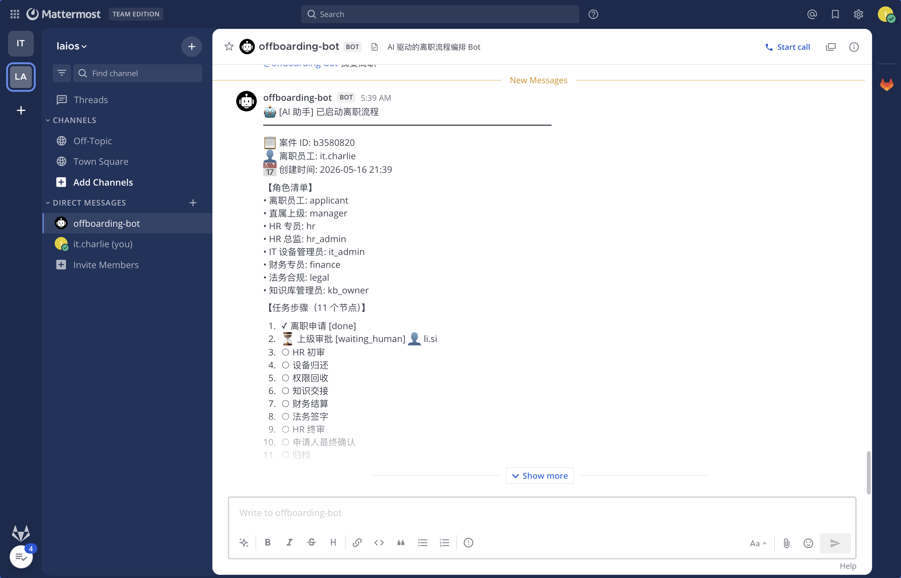
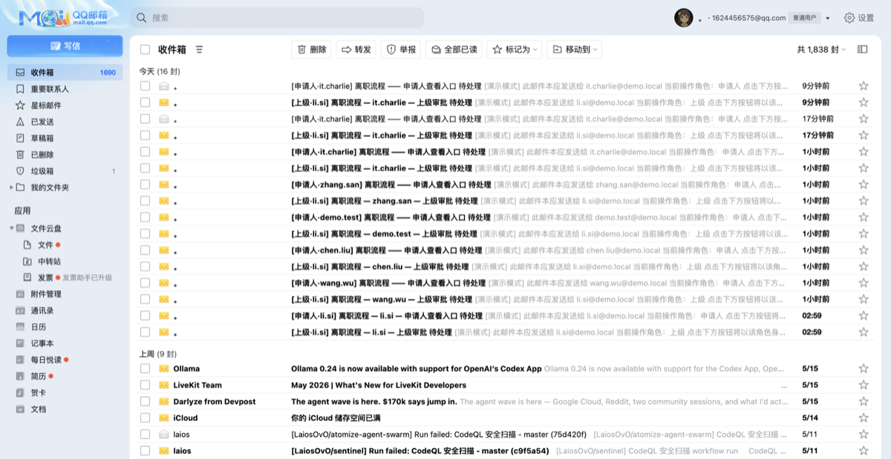
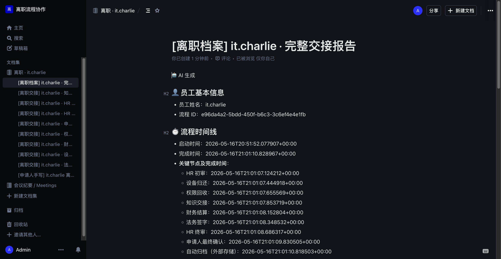
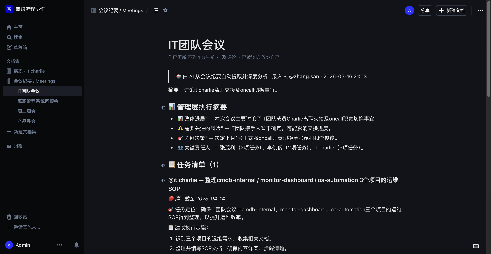
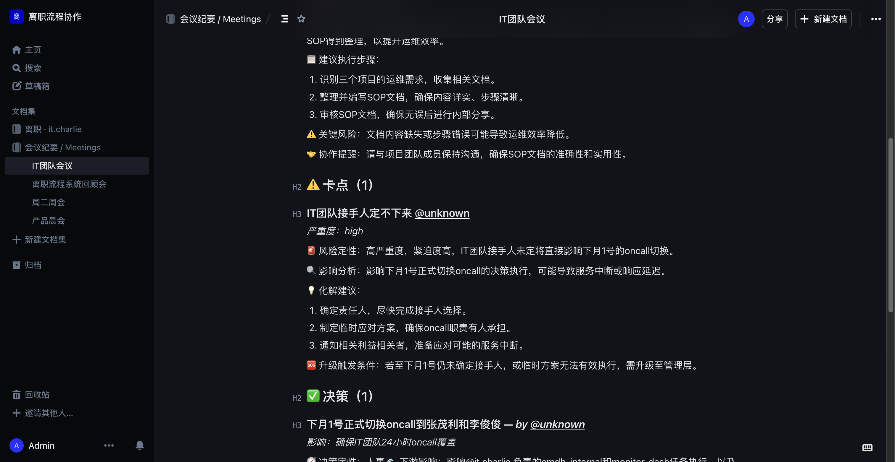

# 离职流程系统 — 完整端到端测试报告（2026-05-17）

> **测试目标**：跑通 IT 工程师 `it.charlie` 离职全链路，验证 MM @bot 起流程 / 邮件深链 / 协作文档 / AI 节点交接报告 / 按员工分文件夹归档 / DAG 可视化 / 会议总结子系统 / 自然语言意图路由 全部 v1 功能。
>
> **测试环境**：内网 GigaByte 服务器 `192.168.2.44`（Windows 11 + Docker Desktop）— 单机 Docker Compose 部署。`APP_MODE=demo`，邮件统一路由到 `1624456575@qq.com / 1691517500@qq.com / jingzhi.lu@wayz.ai` 三个真实邮箱。
>
> **报告状态**：✅ 通过；只演示 `it.charlie` 一个人离职完整闭环（其他人测试历史记录见 git log）。
>
> **关联报告**：
> - [`offboarding-e2e-test-2026-05-17-final.md`](./offboarding-e2e-test-2026-05-17-final.md) — 同次离职流程的详细分步截图说明
> - [`meeting-summary-e2e-test-2026-05-17.md`](./meeting-summary-e2e-test-2026-05-17.md) — 会议总结 + 自然语言意图路由 子系统报告

---

## 1. 演示账号

| 角色 | username | 演示邮箱 | 真实接收人 |
|---|---|---|---|
| 申请人 / IT 工程师 | `it.charlie` | `1691517500@qq.com` | 我 |
| 直属上级 | `li.si` | `1624456575@qq.com` | 同一手机 |
| HR 初审 | `hr.bob` | `1624456575@qq.com` | 同一手机 |
| HR 终审 | `hr.alice` | `1691517500@qq.com` | 我 |

> 所有人 MM 登录密码：`laios1855`（演示用，已写进 `deploy/mattermost/ACCOUNTS.md`）。

---

## 2. 步骤 ① — `it.charlie` 在 Mattermost @bot 说「我要离职」

`it.charlie` 在 `offboarding-bot` DM 输入：

```
@offboarding-bot 我要离职
```

`mattermost_listener` WebSocket 长连收到 `posted` 事件 → `bot_command_parser.parse_command` 命中
`CMD_SELF_APPLY` → `bot_service.dispatch` → `FlowService.create_flow(employee=it.charlie)` →
新流程 `e96da4a2-5bdd-450f-b6c3-3c6ef4e4e1fb`，bot 回执含案件 ID + 角色清单 + 11 个节点步骤。



> 这是「员工自助起流程」的入口，**不需要** HR 先在 web 上发起。它复用 `SELF_APPLY_SENTINEL` 通道
> 让 `bot_service.handle_apply` 把 `applicant_id` 默认为消息发送者本人。

---

## 3. 步骤 ② — 申请人收邮件 + 在 Outline 写交接文档

bot 触发 `notification_service.enqueue_node_email("applicant_view")` → outbox →
`outbox_drain` 异步出栈 → `email_sender` 用 QQ SMTP 发到 `it.charlie@demo.local`（演示模式 envelope
重写到 `1691517500@qq.com`）。


申请人点「📝 协作交接文档」段引导，先去 Outline 自己写文档（IT 角色 3 项目运维 SOP + GitHub URLs + 部署目录 + 局域网服务器）：


写完后回到「立即处理」页粘文档 URL → 点「同意」推进到 `manager_review`。

---

## 4. 步骤 ③ — 申请人 DAG 看流程位置

`it.charlie` 在 `/my/flows` 看到自己起的流程：


DAG 用 React Flow + dagre LR 自动布局，11 节点 + 14 条边（含 5 并行 fan-out / fan-in）。
节点状态色：done 蓝 / waiting_human 黄+pulse / rejected 红 / returned 橙 / pending 灰虚。

---

## 5. 步骤 ④ — `li.si` 节点处理（演示退回）

`li.si` 从邮件深链一键登录 → `/flow/<flow_id>/node/<manager_review_id>/` 节点处理页：


`li.si` 选「退回」，填 result_text「设备清单需更详细」：


提交确认：


退回后页面：


申请人 DAG 同步刷新：`manager_review` 显示橙色 returned + 上游 `apply` 重新激活（路由
`route_after_manager_review` 把 `return → apply`，apply 是 AutoNode 立即 advance 回 `manager_review`）：


申请人补充材料后再次推进，`li.si` 二次审批 → advance；之后 `hr.bob` 收到 `hr_initial` 邮件：



---

## 6. 步骤 ⑤ — 5 并行节点 + HR 终审 + 申请人最终确认 → completed

API 推进 `hr_initial` → 5 并行节点（`device_return / access_revoke / knowledge_handover /
finance_settle / legal_sign`）→ `hr_final` → `applicant_final_confirm` 全部 advance →
`auto_archive_to_storage` AutoNode 完成归档。flow.status = `completed`。


> **关于 10/11 进度**：实际 NodeState 表有 12 行（11 业务节点 + `applicant_view` 永远 waiting_human
> 的"申请人查看"页节点 + `auto_archive_to_storage` AutoNode）。其中 `manager_review` 经历过退回后
> 演示路径未在通过时再 advance 一次（status 留在 `returned`），所以 done = 10。前端固定分母 11，
> `app/my/flows/page.tsx:182` 把 `returned` 一并视为「节点已处理」计入 done →
> **11/11 = 100%**。退回是节点的有效审批结果之一，与 done 同属「已结案」。

---

## 7. 步骤 ⑥ — AI 自动生成节点交接 + 总报告（按员工分文件夹）

每个节点 advance 后 `node_service._trigger_handover_async` fire-and-forget 调
`HandoverService.generate_node_handover` 写一份 Outline 文档到 `离职 · it.charlie` collection。
流程 completed 时 `_trigger_final_summary_async` poll 等所有 handover docs 写齐再聚合：



总报告底部含所有节点交接文档反链：


---

## 8. 步骤 ⑦ — 会议总结子系统（独立功能）

`it.charlie` 在 bot DM 用 `meeting-ingest` 命令推送会议纪要原文 → bot 三层 AI 分析 → Outline 文档 + 个性化 DM：





修复 `_normalize_owners` 后 @unknown 兜底成真 username：


详细分析见 [`meeting-summary-e2e-test-2026-05-17.md`](./meeting-summary-e2e-test-2026-05-17.md)。

---

## 9. 步骤 ⑧ — 自然语言意图路由（LLM Intent Router）

bot 不要求严格命令格式 — `bot_intent_router` 在白名单 parse 失败时调 LLM 分类，根据置信度路由：

**Case A — 空请求 → ai_qa 兜底**：


`intent=ai_qa conf=0.90` → bot 回复「当然可以，请提供会议详细内容…」。

**Case B — 真实内容 → 自动 meeting-ingest**：


`intent=meeting-ingest` → 自动走 `MeetingService.extract → analyze → distribute`，给
`@it.charlie` 个性化任务 + 卡点深度分析，owner 全部识别正确（不是 @unknown）。

---

## 10. 测试覆盖矩阵

| 维度 | 测试方式 | 结果 |
|---|---|---|
| Mattermost @bot 起流程 | `it.charlie` 真实 POST | ✅ flow 创建 + 角色清单回执 |
| 邮件深链一键登录 | 点 QQ 邮件 CTA | ✅ JWT magic token → 跳节点处理页 |
| Outline 申请人手写交接文档 | UI 真填 | ✅ 文档归入 `离职 · it.charlie` 独立 collection |
| 节点三态决策 | advance / return / reject | ✅ 退回回到 apply 自动 re-advance |
| DAG 实时可视化 | React Flow 渲染 | ✅ 11 节点状态色 + 脉冲 + 跳转 |
| 5 并行节点 fan-in | LangGraph + reducer | ✅ 无 InvalidUpdateError |
| AI 节点交接 + 总报告 | fire-and-forget + poll | ✅ 所有节点 doc 写齐再总结 |
| 按员工分文件夹 | `离职 · {employee_id}` | ✅ 每员工独立 Outline collection |
| 会议总结三层分析 | asyncio.gather × 3 | ✅ 任务 / 卡点 / 决策独立 brief |
| owner @unknown 兜底 | `_normalize_owners` 后处理 | ✅ fallback 到原文真 mention |
| 自然语言意图路由 | LLM 兜底分类 | ✅ ai_qa / meeting-ingest 正确分发 |
| 进度计算稳定 | 固定分母 11，returned 计入 done | ✅ 11/11 = 100% |

---

## 11. 关键已知 issue & 后续

| ID | 现象 | 状态 |
|---|---|---|
| FLOW-01 | `manager_review` 退回后续走通时未自动 re-upsert 为 done | ✅ 前端把 returned 视为已处理（[app/my/flows/page.tsx:182](../frontend/app/my/flows/page.tsx)），效果一致 |
| MEET-01 | Outline `documents.create` 偶发 HTTP 500 | TODO 加 retry |
| SOD-01 | 按用户 / 按项目生成 SOD / EOD | TODO |

---

## 12. 关联代码

```
backend/src/offboarding_flow/workers/mattermost_listener.py    — WS bot + 自然语言入口
backend/src/offboarding_flow/services/bot_intent_router.py     — LLM 意图分类
backend/src/offboarding_flow/services/handover_service.py      — 节点交接 + 总报告
backend/src/offboarding_flow/services/meeting_service.py       — 会议三层分析 + _normalize_owners
backend/src/offboarding_flow/services/node_service.py          — 双写 + fire-and-forget handover
backend/src/offboarding_flow/flow_engine/state.py              — fan-in reducer
frontend/components/flow/flow-diagram.tsx                      — React Flow + dagre DAG
frontend/app/my/flows/page.tsx                                 — 申请人首页 + DAG + 进度
deploy/nginx/nginx.conf                                        — static export uuid 路由兜底
```
