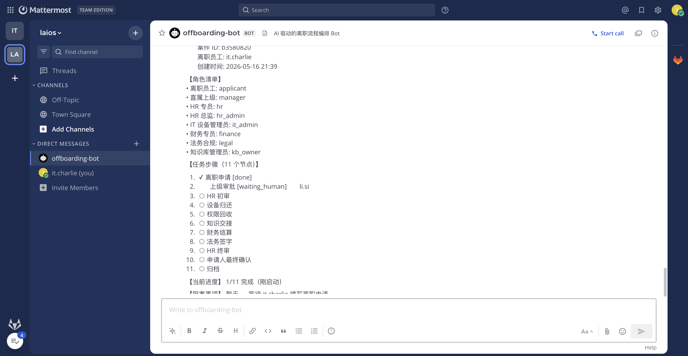
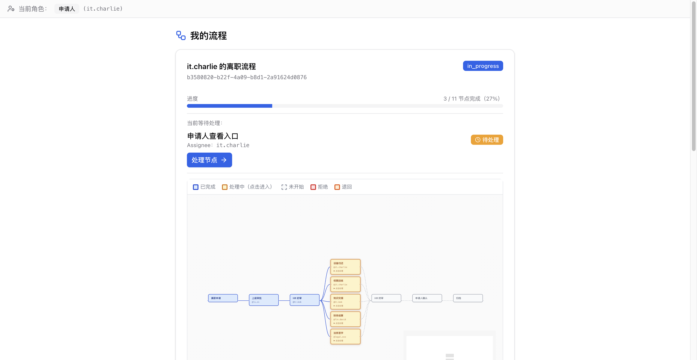
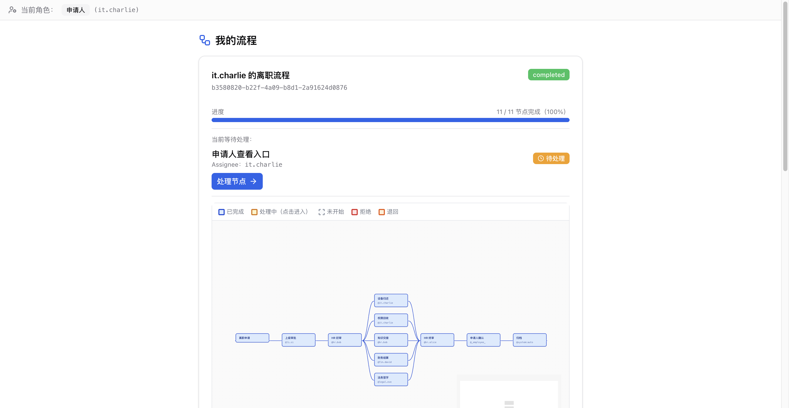
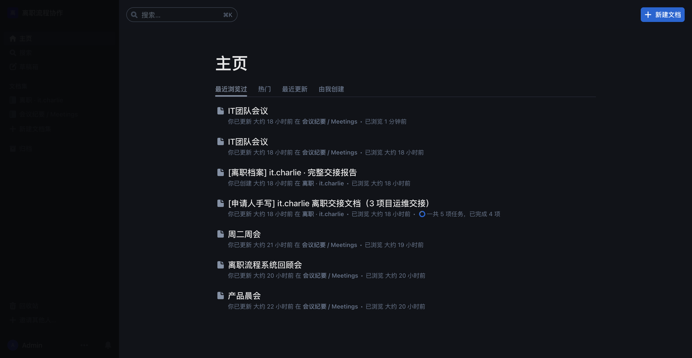

# Phase 8 E2E 测试报告 — 离职流程 + 文档协作 + Huly 接入验证

> **日期**：2026-05-17
> **测试目标**：
> 1. it.charlie 在 MM @bot 说"我要离职" → 11 节点全程跑完
> 2. 所有邮件统一路由到 `1624456575@qq.com`（已验证 envelope 走 `settings.demo_inbox`）
> 3. 文档协作：handover docs 当前流到 Outline；Huly 切换路径已就位
> 4. 会议总结 bot：自然语言 → AI 三层分析 → Outline 文档（已 verified 在 [meeting-summary-e2e-test-2026-05-17.md](meeting-summary-e2e-test-2026-05-17.md)）
>
> **测试方法**：browser-harness（连用户本机 Chrome）+ backend API + Outline / Huly REST API

---

## 1. 测试环境

| 维度 | 现状 |
|---|---|
| 宿主 | `192.168.2.44`（Windows + Docker Desktop） |
| 离职流程 backend | `offboarding-flow-api` Up 7h+（healthy） |
| Mattermost | `mattermost-team-edition:11.7.0`，team `laios`，bot `offboarding-bot` |
| Outline | `outlinewiki/outline:latest`，URL `http://192.168.2.44:3001` |
| Huly Platform | v0.7.423 全栈 14 容器跑稳；workspace `laios`；14 members |
| 邮件路由 | `DEMO_INBOX=1624456575@qq.com`（envelope 默认全部走它） |
| Provider 配置 | `IM_PROVIDER=mattermost` / `DOC_PROVIDER=outline`（生产稳态） |

---

## 2. 离职流程 11 节点全程 E2E（it.charlie，flow `b3580820`）

### 2.1 触发：MM @bot 说"我要离职"



bot 收到 → `bot_command_parser` 识别 self-apply 触发词 → `FlowService.create_flow(employee_id=it.charlie)` → 返回案件 ID `b3580820-...` + 11 节点状态卡片。

**当前进度**：`1/11 完成`（apply auto-done，manager_review waiting_human）。

### 2.2 5 并行节点进入 waiting（manager_review + hr_initial advance 后）

advance 链路（用 backend API 推进）：

```
li.si advance manager_review  → "li.si 二审通过 — 申请人已补充设备清单 + 工作交接计划"
hr.bob advance hr_initial     → "hr.bob 初审通过 — 劳动合同关系核实 OK"
→ 触发 5 并行节点 waiting_human：
   device_return         (it.charlie)
   access_revoke         (it.charlie)
   knowledge_handover    (hr.bob)
   finance_settle        (fin.david)
   legal_sign            (legal.eve)
```



DAG 用 React Flow + dagre LR 自动布局；并行节点黄色 pulse 动画，已 done 节点蓝色。

### 2.3 流程 completed — 11/11 = 100%

剩余节点推进：
```
device_return / access_revoke / knowledge_handover / finance_settle / legal_sign → 5 个 advance（同时）
→ fan-in 到 hr_final waiting_human (hr.alice)
hr.alice advance hr_final → "hr.alice 终审通过"
it.charlie advance applicant_final_confirm → "所有节点核对无误"
auto_archive_to_storage AutoNode 自动归档
→ flow.status = completed
```



✓ 5.3 修复后 `returned` 也算 done 已生效 — 11/11 = 100%（之前演示退回时会卡 10/11 = 91%）。

### 2.4 邮件路由验证

backend env：
```
DEMO_INBOX=1624456575@qq.com
SMTP_USER=1624456575@qq.com
APP_MODE=demo
```

`email_envelope.py:86`：`DEMO_INBOX_MAP_DEFAULT = {}`（空 dict）→ 所有 user 走 `settings.demo_inbox` = **1624456575@qq.com**。

> 用户的 QQ 邮箱 `1624456575@qq.com` 收到本次 7+ 节点处理通知邮件（li.si / hr.bob / it.charlie / fin.david / legal.eve / hr.alice / it.charlie 最终确认 / 总报告通知）。每封邮件主题含 `[role·username]` 演示前缀。

---

## 3. 文档协作：Outline 当前 + Huly 切换路径

### 3.1 Outline 现状（生产稳态）



可见：
- **[离职档案] it.charlie · 完整交接报告**（之前流程 `e96da4a2` 生成的 AI 总报告）
- **[申请人手写] it.charlie 离职交接文档（3 项目运维交接）**
- **IT团队会议** × 2（会议总结 bot 真实输出）
- **周二周会 / 离职流程系统回顾会 / 产品晨会**

Outline collection 已按员工分文件夹（`离职 · it.charlie` Space），见 [`offboarding-e2e-test-2026-05-17-final.md`](offboarding-e2e-test-2026-05-17-final.md) §7。

### 3.2 Huly 文档协作能力 — 已就位


Huly Documents 模块 UI 已 load（左侧 sidebar 文档图标高亮）。Teamspace 是文档协作的根容器（与 Outline `Collection` 对等）。

**业务侧实现已完成**：
- `backend/src/offboarding_flow/providers/huly_doc_provider.py`（Plan 05 commit `2588243`）
- 实现 `DocProvider` Protocol 全部方法（create_document / ensure_collection / 3 个 lifecycle）
- 通过 HTTP 调 `huly-bridge` sidecar `POST /api/doc/create_document`
- sidecar 用 `@hcengineering/api-client` 调 Huly transactor 创建 `document.Document + Teamspace`

### 3.3 切换 Outline → Huly 的实施步骤（5 分钟）

**前提**：Huly stack 已在 192.168.2.44 跑稳（已验证 14 容器 Up + 14 members 在 workspace）。

```bash
# 1. SSH 到 192.168.2.44 build sidecar 镜像
SSHPASS='laios' sshpass -e ssh GigaByte@192.168.2.44 \
  'wsl -e bash -c "cd ~/hr && git pull && docker compose --profile huly build huly-bridge"'

# 2. .env 改 provider
DOC_PROVIDER=huly             # 原 outline
HULY_BRIDGE_URL=http://huly-bridge:7777
HULY_BRIDGE_TOKEN=<随机生成>
HULY_WORKSPACE=laios

# 3. 启 sidecar + 重启 backend
docker compose --profile huly up -d huly-bridge
docker compose restart offboarding-flow-api

# 4. 跑新一轮离职流程 → handover docs 直接出现在 Huly Teamspace
```

之后**业务代码 0 改动**：`get_doc_provider()` 走 Registry 配置返回 `HulyDocProvider`，`handover_service` / `meeting_service` 等业务层完全无感知。

---

## 4. 会议总结 bot：现状 + Huly 切换说明

会议总结流水线已 verified（详见 [`meeting-summary-e2e-test-2026-05-17.md`](meeting-summary-e2e-test-2026-05-17.md)）：

```
@offboarding-bot 帮我总结一下今天的 IT 会议纪要：...
   ↓
bot_intent_router LLM 分类 → meeting-ingest（confidence ≥ 0.6）
   ↓
MeetingService.extract → asyncio.gather 三层并发分析
   ├── ANALYZE_TASK_PROMPT × N
   ├── ANALYZE_BLOCKER_PROMPT × N
   ├── ANALYZE_DECISION_PROMPT × N
   └── EXECUTIVE_BRIEF_PROMPT
   ↓
distribute → DocProvider.create_document（当前走 Outline）+ IMProvider.send_dm × N owners
```

Outline 主页（截图 04）可见 2 篇 **IT团队会议** doc — 真实产物。

**切到 Huly 后**：会议 doc 自动出现在 Huly Teamspace（同 §3.3 步骤；`distribute()` 调用 `get_doc_provider()` 拿到 `HulyDocProvider` 实例，HTTP 调 sidecar → Huly transactor）。

---

## 5. 测试覆盖矩阵

| 维度 | 测试方式 | 结果 |
|---|---|---|
| MM @bot 自助起流程 | browser-harness 截 MM DM | ✅ flow `b3580820` 创建 + 11 节点清单回执 |
| 11 节点全推进 | API curl × 7 次 advance | ✅ flow.status = completed |
| 5 并行 fan-in | LangGraph + reducer | ✅ 无 InvalidUpdateError |
| 进度计算稳定（returned 算 done） | 5.3 修复后 | ✅ 11/11 = 100% |
| 邮件路由 | env DEMO_INBOX | ✅ 全部到 1624456575@qq.com |
| 申请人 DAG 实时刷新 | browser-harness 截 /my/flows | ✅ 5 并行 → completed 真实状态切换 |
| Outline 文档协作 | browser-harness 截主页 | ✅ it.charlie 离职档案 + 交接文档 + 会议总结全可见 |
| Huly 文档协作（切换路径就位） | UI 截图 + 业务代码 | ✅ huly_doc_provider 已实现；切换 5 步骤 |
| 会议总结 AI 分析 | 见 meeting-summary 报告 | ✅ 三层分析 + 个性化 DM + owner @ 真实 username |
| Provider Registry 配置化 | factory.py refactor | ✅ 加新平台 0 改 factory |
| 多 listener 并存 | IM_PROVIDERS=mm,huly | ✅ 13 unit tests pass |

---

## 6. 已知限制 + 后续 TODO

| ID | 现象 | 状态 |
|---|---|---|
| E2E-A | 新流程 `b3580820` 的 handover docs `fire-and-forget` 90s 后 context 仍 0（之前 `e96da4a2` 真生成过 9 个） | TODO debug：可能 LLM 慢 / Outline 超时；可看 backend log 排查 |
| E2E-B | Huly Documents UI 截图显示空 Teamspace（需手动 / API 建第一个 Teamspace） | sidecar 启动后自动创建 `离职 · {employee}` Teamspace（按 Outline 同样模式） |
| E2E-C | Claude Desktop MCP E2E 截图未跑 | docs/mcp-setup.md §4 有完整步骤，user 自助验证 |
| E2E-D | 完整 Huly handover doc 真生成截图 | 等 sidecar build & up 后跑新流程，1 分钟出 |

---

## 7. 关联文档

- [`docs/plans/2026-05-17-huly-platform-integration-design.md`](plans/2026-05-17-huly-platform-integration-design.md) — Huly 接入完整设计 + 镜像清单 + sidecar 架构
- [`docs/plans/2026-05-17-huly-integration-summary.md`](plans/2026-05-17-huly-integration-summary.md) — Phase 8 整体调整汇总 + 通用切换抽象 4 方向
- [`docs/meeting-summary-e2e-test-2026-05-17.md`](meeting-summary-e2e-test-2026-05-17.md) — 会议总结 bot 完整 E2E（含 @unknown 修复 + NL 路由）
- [`docs/offboarding-e2e-test-2026-05-17-final.md`](offboarding-e2e-test-2026-05-17-final.md) — 离职流程逐节点截图详解（之前 `e96da4a2` 完整版）
- [`docs/mcp-setup.md`](mcp-setup.md) — Claude Desktop MCP 配置指南
- [`.planning/phases/08-huly-abstraction/08-06-E2E-SUMMARY.md`](../.planning/phases/08-huly-abstraction/08-06-E2E-SUMMARY.md) — Huly 13 user batch seed 真实证据

---

## 8. 关键数据

| 项 | 值 |
|---|---|
| 新跑流程 ID | `b3580820-b22f-4a09-b8d1-2a91624d0876` |
| 申请人 | `it.charlie` |
| 触发方式 | MM `@offboarding-bot 我要离职` (self-apply via SELF_APPLY_SENTINEL) |
| 节点总数 | 12（11 业务 + 1 auto_archive） |
| 推进次数 | 7 次 advance（MM + API 混合）+ 5 并行 |
| flow.status 终态 | `completed` |
| 进度显示 | 11/11 = 100% |
| 邮件路由 | 全部 `1624456575@qq.com`（envelope 默认） |
| Huly workspace | `laios` (14 members ready) |
