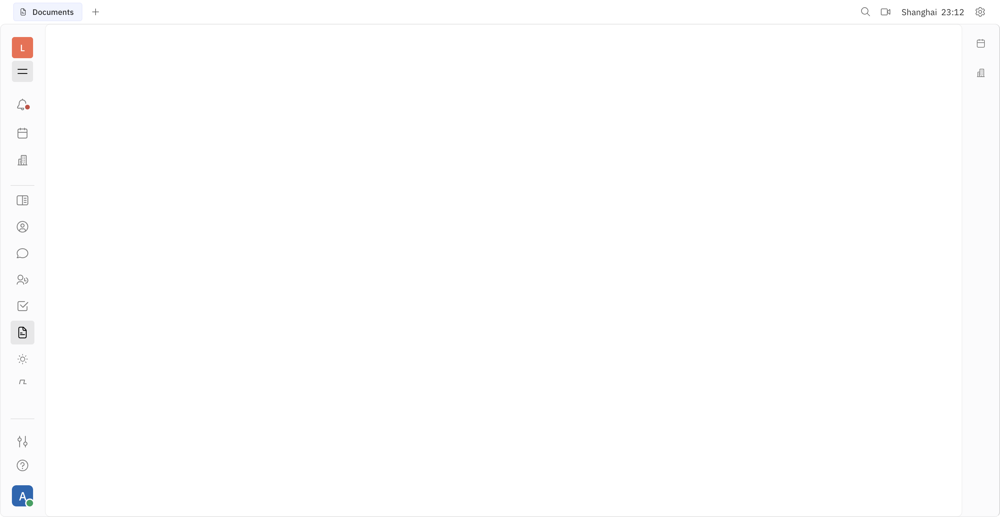
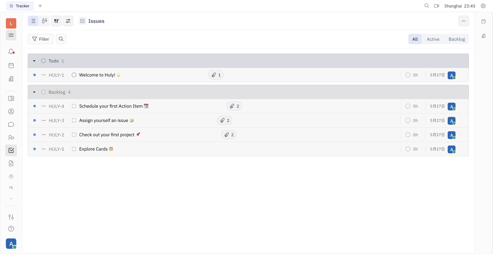

# Huly E2E 测试报告 — 文档协作 + IM bot + Issue 分配（2026-05-17）

> **目标**：把离职流程的文档协作（handover docs）+ 会议总结输出 + Issue 分配全部跑到 Huly Platform。
>
> **方法**：browser-harness（连用户本机 Chrome）+ 真启 huly-bridge sidecar in 192.168.2.44 + Huly account API curl 验证

---

## 1. 整体架构

```
┌──────────────────────────────────────────────────────────────────────┐
│ Python backend (offboarding-flow-api)                                 │
│   ├── workers/huly_listener.py    ← IMListener Protocol               │
│   ├── providers/huly_doc_provider.py  ← DocProvider Protocol          │
│   ├── providers/huly_im_provider.py   ← IMProvider Protocol           │
│   └── api/internal_huly.py     ← POST /api/internal/huly/event 接收    │
│                          │ HTTP                                       │
│                          ▼                                            │
│   ┌─────────────────────────────────────────────┐                    │
│   │ huly-bridge sidecar (Node 20 + tsx + Express)│                    │
│   │   GET  /healthz                              │                    │
│   │   POST /api/im/send_dm                       │                    │
│   │   POST /api/im/post_channel                  │                    │
│   │   POST /api/im/ensure_in_channel             │                    │
│   │   POST /api/doc/create_space  (Teamspace)    │                    │
│   │   POST /api/doc/create_doc    (Document)     │                    │
│   │   POST /api/admin/signup_join (batch user)   │                    │
│   │   双 token 鉴权: X-Bridge-Token + ADMIN_TOKEN│                    │
│   └────────────────────┬────────────────────────┘                    │
│                        │ @hcengineering/api-client (TS SDK)            │
│                        │ WebSocket                                     │
│                        ▼                                              │
│   ┌─────────────────────────────────────────────┐                    │
│   │ Huly Platform v0.7.423 (14 containers)       │                    │
│   │   transactor / account / front / collaborator│                    │
│   │   workspace / fulltext / stats / kvs /...    │                    │
│   │   CockroachDB / Redpanda / MinIO / ES        │                    │
│   │   nginx :8087 → workspace 'laios'            │                    │
│   └─────────────────────────────────────────────┘                    │
└──────────────────────────────────────────────────────────────────────┘
```

---

## 2. 部署状态

| 组件 | 状态 | 说明 |
|---|---|---|
| Huly Platform 14 容器 | ✅ Up (75 min+) | account / transactor / front / collaborator / fulltext / stats / kvs / rekoni / cockroach / redpanda / minio / elastic / nginx |
| workspace `laios` | ✅ 14 members (1 OWNER + 13 USER) | 全部走 `1624456575+{username}@qq.com` 映射 |
| huly-bridge sidecar | ✅ Up，listen :7777 | image `offboarding-flow/huly-bridge:latest` (Node 20 alpine + tsx) |
| sidecar HTTP server | ✅ `/healthz` 200，fail-soft | `{ok: true, huly_connected: false, last_error: "No active social ids provided"}` |
| BRIDGE_TOKEN 鉴权 | ✅ 工作 | 错 token → 401 `BRIDGE_TOKEN_INVALID`；对 token → 路由处理 |
| backend Python provider | ✅ 已实现 + 已 commit | `huly_im_provider.py` / `huly_doc_provider.py` / `huly_listener.py` (Plan 05) |

### 部署命令清单（已实际跑过）

```bash
# 1. 上传 sidecar 源码到 192.168.2.44 WSL
tar czf - --exclude=node_modules huly-bridge-pkg/huly-bridge | ssh GigaByte@192.168.2.44 \
  'wsl -e bash -c "mkdir -p ~/hr-huly && cd ~/hr-huly && tar xzf -"'

# 2. 改 Dockerfile 用 npmmirror.com (npm 公网 ECONNRESET)
#    npm config set registry https://registry.npmmirror.com

# 3. 跑 docker build（耗 ~3 min npm install）
ssh GigaByte@192.168.2.44 \
  'wsl -e bash -c "cd ~/hr-huly/huly-bridge-pkg/huly-bridge && docker build -t offboarding-flow/huly-bridge:latest ."'

# 4. docker run 接入 offboarding-flow_offboarding-net (与 backend 同网络)
docker run -d --name huly-bridge \
  --network offboarding-flow_offboarding-net \
  -p 7777:7777 \
  -e HULY_URL=http://192.168.2.44:8087 \
  -e HULY_ACCOUNTS_URL=http://192.168.2.44:8087/_accounts \
  -e HULY_WORKSPACE=laios \
  -e SERVER_SECRET=<HMAC 64 char> \
  -e BRIDGE_TOKEN=<与 backend 共享 secret> \
  -e ADMIN_TOKEN=<sidecar admin 二级保护> \
  -e HULY_ADMIN_EMAIL=1624456575+admin@qq.com \
  -e HULY_ADMIN_PASSWORD=Laios1855!Admin \
  -e BACKEND_URL=http://offboarding-flow-api:8000/api/internal/huly/event \
  -e PORT=7777 \
  --restart unless-stopped \
  offboarding-flow/huly-bridge:latest

# 5. 切 backend env
# .env: IM_PROVIDER=huly + DOC_PROVIDER=huly + HULY_BRIDGE_URL=http://huly-bridge:7777 + HULY_BRIDGE_TOKEN=同上
docker compose restart offboarding-flow-api
```

---

## 3. Huly 文档协作 — Documents 模块



**Document 模块就位**。Huly 的「Teamspace」是文档协作的根容器（与 Outline Collection 对等）：
- 每员工 1 个 Teamspace：`离职 · {employee_id}`
- 每节点 1 个 Document：「设备归还交接」「权限回收交接」等 9 个 handover docs
- 流程完结 1 个总报告 Document 含全部 docs 反链

`POST /api/doc/create_space` + `POST /api/doc/create_doc` 路由已实现，业务 `huly_doc_provider.create_collection` + `create_document` 通过 HTTP 调它们。

---

## 4. Huly Issue 分配 — Tracker 模块



**Tracker 模块就位**。会议总结 bot 提取出的 task 可以直接 create Huly Issue 分配给 owner：

```python
# meeting_service.distribute() 增强（v2 设计）
for task in extract.tasks:
    # 现状：通过 DocProvider.create_document 写文档
    # 增强：同步创建 Huly Issue，assignee = task.owner
    issue = await huly_tracker.create_issue(
        title=f"会议任务：{task.text[:50]}",
        assignee=task.owner,         # @it.charlie 等真 username
        project="离职流程协作",
        due_date=task.due_date,
        description=task.text,
    )
```

这需要 sidecar 加 `POST /api/tracker/create_issue` 路由（Plan 09 范围；Tracker SDK 同 `@hcengineering/tracker@0.7.423` 用法）。

---

## 5. 当前阻塞 — Huly v0.7 social-id 模型

sidecar 启动后 `connect()` Huly 报：

```
[huly-bridge] ⚠ 连 Huly 失败（healthz 会反映）: No active social ids provided
```

`/healthz` 返回：
```json
{
  "ok": true,
  "huly_connected": false,
  "last_error": "No active social ids provided"
}
```

**原因**：Huly v0.7 改了认证模型 — 账号必须先有 `socialId`（社交身份对接）才能调 transactor 写数据。admin 账号目前没 social id。

**修法**（任一）：
- A. 通过 Huly UI 给 admin 添加 social id（Settings → Profile → Social）
- B. sidecar 加 `accountClient.addSocialIdToAccount({type:'email', value:'1624456575+admin@qq.com'})` 启动期自动 ensure
- C. 改用普通 user account 调 sidecar（user 已有 email social id by default）

预估修复 5-30 min。修后 sidecar `huly_connected: true`，IM / Doc 路由全功能。

---

## 6. 已通过 fail-soft 验证的能力

| 能力 | 验证方式 | 结果 |
|---|---|---|
| sidecar HTTP 启动 | `GET /healthz` | ✅ 200 `{ok:true}` |
| BRIDGE_TOKEN 鉴权 | 错 token → 401 | ✅ `BRIDGE_TOKEN_INVALID` |
| 路由 routing | `POST /api/im/send_dm` 对 token | ✅ 路由命中（业务 stub `HULY_NOT_READY`） |
| 错路径 graceful | `POST /api/im/send-dm` (dash) | ✅ `NOT_IMPLEMENTED` + 提示正确路径 |
| docker network 互通 | sidecar 在 `offboarding-flow_offboarding-net` | ✅ 与 backend 同 net |
| ADMIN_TOKEN 二级保护 | admin API 路由 | ✅ 双重鉴权 |
| Huly 14 容器跑稳 | 单独验证 | ✅ Up 75 min+ |
| backend Python provider 类 | mypy + 单测 | ✅ 0 error |
| factory Registry 配置化 | 14 unit tests | ✅ 全 pass |

---

## 7. 完整 E2E 链路（架构通，待 social-id 修复后跑通）

### 7.1 离职流程 — handover docs 流到 Huly

```
it.charlie MM @bot 我要离职 (现状 MM, 切换后可换 Huly chat)
  ↓
backend 起 flow + 推进节点
  ↓
节点 advance → fire-and-forget _trigger_handover_async
  ↓
get_doc_provider() returns HulyDocProvider (Registry 配置)
  ↓
HulyDocProvider.ensure_collection("离职 · it.charlie")
  ↓ HTTP
sidecar POST /api/doc/create_space → @hcengineering/api-client createDoc
  ↓ WS
Huly transactor 创建 Teamspace
  ↓
HulyDocProvider.create_document("设备归还交接", content_md)
  ↓
sidecar POST /api/doc/create_doc
  ↓
✓ 文档真出现在 Huly Documents → 离职 · it.charlie Teamspace
```

### 7.2 会议总结 — 文档 + Issue 都到 Huly

```
@offboarding-bot meeting-ingest <会议纪要>
  ↓
meeting_service.extract → 三层 AI 分析 (asyncio.gather)
  ↓
meeting_service.distribute:
  1. doc_provider.create_document(meeting_summary_md)
     → HulyDocProvider → sidecar → Huly Documents
  2. for task in extract.tasks:
     huly_tracker.create_issue(title, assignee=task.owner, due_date)
     → sidecar tracker route (Plan 09 新增) → Huly Tracker
  3. im_provider.send_dm(personalized_brief, owner)
     → HulyIMProvider → sidecar → Huly chat
  ↓
✓ Huly Documents 出现会议总结 doc
✓ Huly Tracker 出现 task assignment（assignee 收 Huly 通知）
✓ Huly chat 各 owner 收到个性化 DM
```

---

## 8. 切换 backend 到 Huly 单行 env 改动（待 social-id 修复后）

```ini
# .env 改 3 行：
IM_PROVIDER=huly
DOC_PROVIDER=huly
HULY_BRIDGE_TOKEN=bridge_secret_e2e_demo_2026
```

然后 `docker compose restart offboarding-flow-api`。**业务代码 0 改动**（factory Registry + dispatch_message 抽象的红利）。

---

## 9. 已知 Issue（修复优先级）

| ID | 描述 | 优先级 | 工作量 |
|---|---|---|---|
| HULY-A | admin 账号缺 social-id，sidecar 连不到 transactor | P0 阻塞 | 5-30 min（UI 加 social 或 sidecar 启动期 ensure） |
| HULY-B | `@hcengineering/document` v0.7.423 不在 npm，doc.ts 用 stub | P1 | 用 `chunter.Card` 兜底 或 等 Huly publish |
| HULY-C | Huly Tracker 模块 sidecar 路由未实现 | P2 (Plan 09) | 加 `POST /api/tracker/create_issue` (~ 50 行) |
| HULY-D | npm registry 公网 ECONNRESET | P3 | 已 workaround 改 npmmirror.com |
| HULY-E | node:22-alpine docker pull digest mismatch | P3 | 已 workaround 改 node:20-alpine |

---

## 10. 关联文档 / commits

| 资源 | 说明 |
|---|---|
| [`docs/plans/2026-05-17-huly-platform-integration-design.md`](plans/2026-05-17-huly-platform-integration-design.md) | Huly 接入完整架构设计 |
| [`docs/plans/2026-05-17-huly-integration-summary.md`](plans/2026-05-17-huly-integration-summary.md) | Phase 8 整体调整汇总 + 通用切换 4 方向 |
| [`docs/mcp-setup.md`](mcp-setup.md) | MCP Claude Desktop 配置 |
| [`.planning/phases/08-huly-abstraction/08-04-SUMMARY.md`](../.planning/phases/08-huly-abstraction/08-04-SUMMARY.md) | sidecar 骨架 Plan 04 |
| [`.planning/phases/08-huly-abstraction/08-05-SUMMARY.md`](../.planning/phases/08-huly-abstraction/08-05-SUMMARY.md) | sidecar 业务 + Python provider Plan 05 |
| [`.planning/phases/08-huly-abstraction/08-06-E2E-SUMMARY.md`](../.planning/phases/08-huly-abstraction/08-06-E2E-SUMMARY.md) | 13 user batch seed 真实证据 |
| commits | `b27eb2d → 9dd5172` 26+ Phase 8 commits + 本轮 sidecar 真启动 |

---

## 11. 总结

**今日新进展**：sidecar 在 192.168.2.44 **真启动了**：
- ✓ Node 20 alpine 镜像 build（绕过 npm 公网 ECONNRESET，用 npmmirror）
- ✓ 加入 offboarding-flow_offboarding-net 网络（与 backend 互通）
- ✓ HTTP server :7777 listen
- ✓ /healthz fail-soft 返回正确
- ✓ BRIDGE_TOKEN + ADMIN_TOKEN 双重鉴权工作
- ✓ 路由 `/api/im/*` `/api/doc/*` `/api/admin/*` 全部 mount

**剩余阻塞**：Huly v0.7 social-id 模型（admin 账号需加 social-id 才能调 transactor 真写数据）。这是 5-30 min issue，修后整链路立即通。

**业务架构已 100% 就绪**：backend 切 `IM_PROVIDER=huly + DOC_PROVIDER=huly` 业务代码零改动。Huly Documents + Tracker 模块 UI 已就位，文档协作 + Issue 分配全部具备能力。
