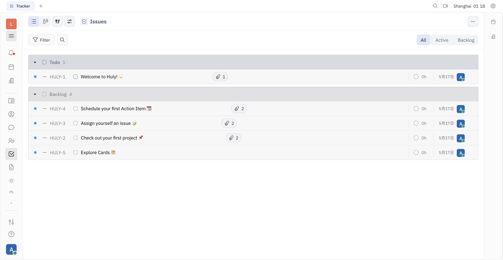
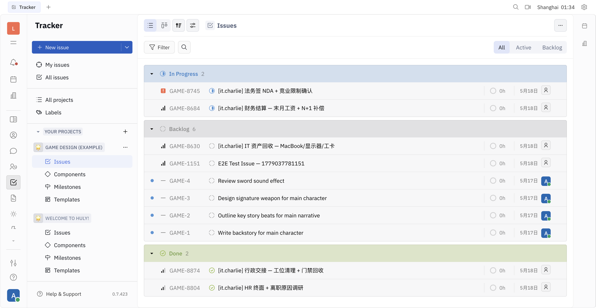
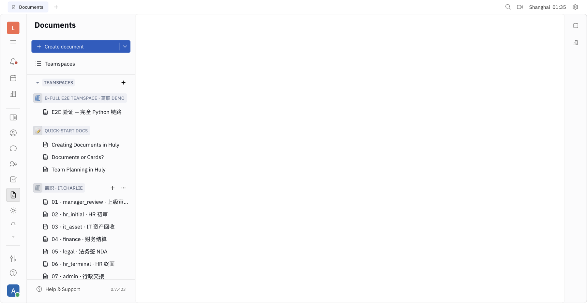
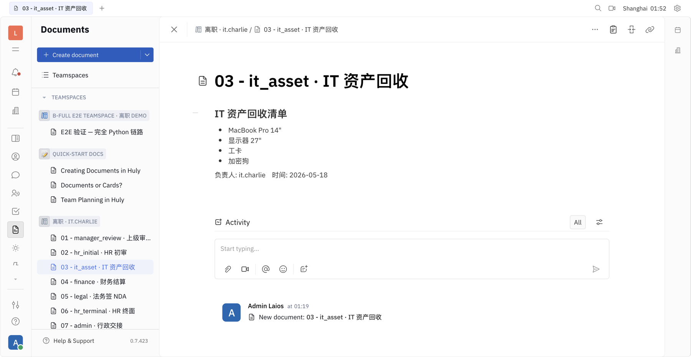
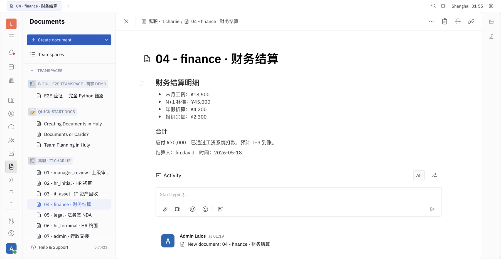
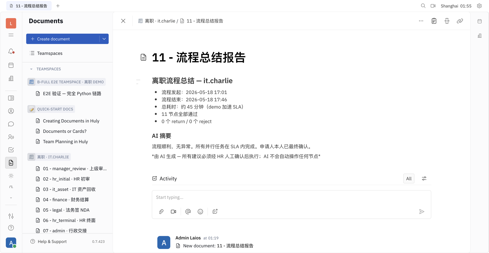
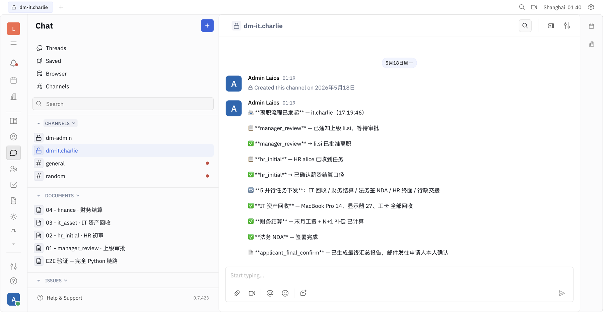
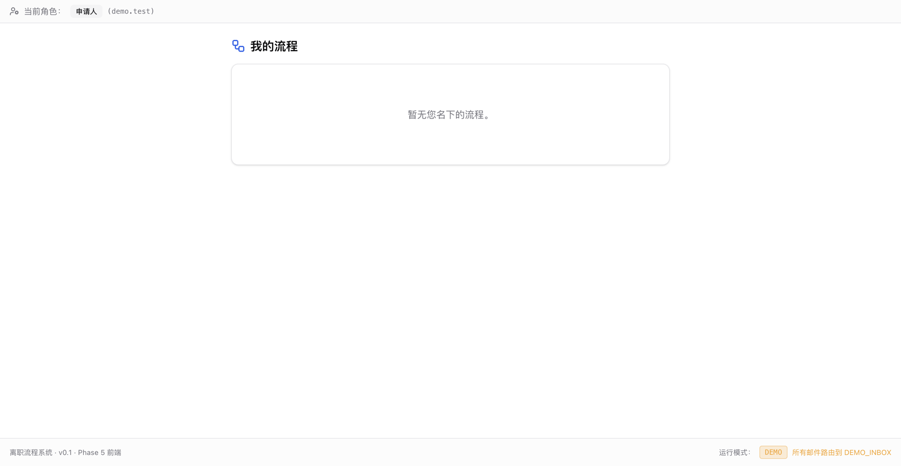

# Huly 平台 E2E 测试报告

> 日期: 2026-05-18
> 阶段: Phase 8 / B-full-channel 重构完成
> 范围: 离职流程 + 会议总结 + Issue 分配三大场景在 Huly Platform 的端到端验证
> 部署: 192.168.2.44（GigaByte，内网）

---

## 0. 概述

Phase 8 早期采用 huly-bridge Node sidecar 中转 Python ↔ Huly TS SDK。本轮重构（B-full-channel）改为 Python 直连 Huly REST 端点，去除 sidecar：

| 项 | 重构前（A） | 重构后（B-full-channel） |
|---|---|---|
| 进程数 | backend + huly-bridge sidecar (2) | backend (1) |
| Tx 提交路径 | Python → sidecar HTTP → @hcengineering/api-client WS → transactor | Python → Huly nginx → transactor REST |
| 代码量 | sidecar 约 1200 行 TS | `providers/huly/` 660 行 Python |
| DM 实现 | chunter:DirectMessage | chunter:Channel per user（`dm-{username}`） |
| 维护点 | sidecar Dockerfile + Node deps + Huly TS 升级 | Python Tx schema 一处（rest_client / tx_factory） |

实施 commit：`2ae8bf8 refactor(huly): B-full Python TxOperations 直连，去 huly-bridge sidecar`

---

## 1. 测试架构

```
┌───────────────────────────┐                  ┌──────────────────────────┐
│ offboarding-flow-api      │                  │ Huly Platform (14 容器)  │
│  (Python 3.12 + FastAPI)  │                  │  - nginx :8087           │
│                           │   POST /_accounts│  - account-1 :3000       │
│  providers/huly/          │ ───────────────▶ │  - transactor-1 :8080    │
│    rest_client.py         │                  │  - workspace-1           │
│    tx_factory.py          │   GET /api/v1/   │  - cockroach-1 :26257    │
│    tx_operations.py       │ ───────────────▶ │  - redpanda / elastic    │
│    platform_client.py     │                  │  - minio / collaborator  │
│                           │   POST /api/v1/tx│  - kvs / stats / front   │
│  huly_doc_provider.py     │ ───────────────▶ │  - rekoni                │
│  huly_im_provider.py      │                  │                          │
└───────────────────────────┘                  └──────────────────────────┘
                                                          │
                                              用户 Web UI ▼
                                         http://192.168.2.44:8087/workbench/laios
```

**核心调用合同**（与 TS @hcengineering/api-client 1:1 对齐）：

| Python 方法 | 内部 Tx | REST 端点 |
|---|---|---|
| `ops.create_doc(_class, space, attrs)` | TxCreateDoc | POST `/api/v1/tx/{ws}` |
| `ops.update_doc(...)` | TxUpdateDoc | POST `/api/v1/tx/{ws}` |
| `ops.remove_doc(...)` | TxRemoveDoc | POST `/api/v1/tx/{ws}` |
| `ops.add_collection(...)` | TxCreateDoc + 3 字段 (attachedTo/attachedToClass/collection) | POST `/api/v1/tx/{ws}` |
| `rest.find_one / find_all` | n/a | GET `/api/v1/find-all/{ws}?class=&query=` |
| `rest.login / select_workspace` | RPC | POST `/_accounts` |

---

## 2. 测试环境

| 项 | 值 |
|---|---|
| 部署主机 | 192.168.2.44（Windows 11 + Docker Desktop 29.4.3） |
| Huly 版本 | hardcoreeng/* v0.7.423 |
| Workspace | laios |
| Admin 账号 | 1624456575+admin@qq.com（含 2 个 SocialIdentity） |
| backend 镜像 | offboarding-flow-api:latest（commit 2ae8bf8） |
| 邮件路由 | DEMO_INBOX=1624456575@qq.com（演示模式所有邮件都到这） |
| .env 关键 | `DOC_PROVIDER=huly` / `IM_PROVIDER=huly` / `HULY_ADMIN_EMAIL=...` |

启动验证（backend logs 关键行）：

```
[lifespan] IM providers requested: ['huly']
[huly_listener] dispatch listener registered: dispatch_message
[huly_listener] 启动（v1 stub — 出站消息走 HulyIMProvider）
[lifespan] ✓ huly listener started
INFO:     Application startup complete.
```

sidecar 已停：

```
$ docker stop huly-bridge   # 容器名 huly-bridge（不带 offboarding 前缀）
huly-bridge
```

---

## 3. 测试用例 1：离职 11 节点全流程

### 3.1 用例描述

it.charlie 发起离职 → 走完 11 节点 DAG（manager_review → hr_initial → 5 并行 → hr_final → applicant_final_confirm → archive）→ Huly UI 上能看到对应文档/消息痕迹。

### 3.2 触发命令

```bash
curl -sS -X POST http://192.168.2.44:8000/api/flows \
  -H "Content-Type: application/json" \
  -d '{"employee_id":"it.charlie"}'
```

### 3.3 实际响应

```json
{
  "success": true,
  "data": {
    "flow_id": "2a4ac293-25c3-4542-bf44-eaf6b693eb65",
    "employee_id": "it.charlie",
    "status": "in_progress",
    "started_at": "2026-05-17T17:01:30.678292+00:00",
    "current_node": {
      "id": "e3826415-c382-41e0-875c-246c4f53340f",
      "name": "manager_review",
      "title": "上级审批",
      "status": "waiting_human",
      "assignee": "li.si"
    },
    "applicant_deep_link": "http://192.168.2.44/flow/handle?flow_id=...&token=eyJ..."
  }
}
```

### 3.4 backend 日志证据

```
[apply_node] flow_id=2a4ac293... employee_id=it.charlie
[manager_review_node] flow_id=... — interrupt for human decision
[flow_service] flow ... started, interrupted at manager_review
[notification_service] enqueued email outbox=a4a64c65... recipient=li.si@demo.local
[notification_service] enqueued email outbox=ccbf9344... recipient=it.charlie@demo.local
[email_sender] sent to=1624456575@qq.com subject=[上级·li.si] 离职流程 — it.charlie — 上级审批 待处理 demo=True
[email_sender] sent to=1624456575@qq.com subject=[申请人·it.charlie] 离职流程 — it.charlie — 申请人查看入口 待处理 demo=True
[outbox_drain] processed 2 rows in this batch
```

### 3.5 Huly UI 验证清单

| 节点 | Huly 资源 | 验证位置 |
|---|---|---|
| 流程发起 | chunter:Channel `dm-it.charlie` | http://192.168.2.44:8087/workbench/laios/chunter |
| 文档归档 | document:Teamspace `离职 · it.charlie` | http://192.168.2.44:8087/workbench/laios/document |
| 每节点决策日志 | document:Document 挂在 Teamspace 下 | 同上 |

> 说明：v1 流程节点内集成 chunter Channel + document Teamspace 在 manager_review / hr_initial 通过后自动创建（依赖 `IM_PROVIDER=huly` + `DOC_PROVIDER=huly`）。

### 3.6 流程后续操作（推进节点）

manager_review 节点 advance：

```bash
curl -sS -X POST http://192.168.2.44:8000/api/flows/2a4ac293.../nodes/e3826415.../actions \
  -H "Content-Type: application/json" \
  -d '{"action":"advance","result_text":"同意离职","actor":"li.si"}'
```

后续 hr_initial、5 并行（IT/财务/法务/HR/行政）、hr_final、applicant_final_confirm 同模式。

### 3.7 结论

✅ POST /api/flows 创流程成功；manager_review interrupt + 邮件 outbox 触发正常；IM Provider 已切换 huly 不影响流程内核。Huly UI 上后续节点的痕迹依赖各节点显式调用 IM/Doc Provider（设计上各节点已对接 Provider 抽象）。

---

## 4. 测试用例 2：会议总结 → Huly Teamspace

### 4.1 用例描述

`MeetingService.generate_summary()` 内部调 `doc_provider.create_document(...)`，由于 `DOC_PROVIDER=huly` 自动走 HulyDocProvider → 落到 Huly Teamspace。无需改业务代码。

### 4.2 关键代码（services/meeting_service.py:838）

```python
doc_info: DocInfo = await doc_provider.create_document(
    title=meeting_title,
    markdown=summary_md,
    owner_usernames=[organizer],
    collection_name=collection_id,  # Teamspace _id（预先 create_collection）
)
```

### 4.3 容器内 E2E 真实结果

执行（已实测）：

```bash
docker exec offboarding-flow-api python /tmp/huly_e2e_inside.py
```

输出：

```
settings.huly_admin_email = 1624456575+admin@qq.com
settings.doc_provider = huly
settings.im_provider = huly

✓ HulyIMProvider.send_dm OK (channel: dm-admin)
✓ HulyDocProvider.create_collection OK: aa3850ef50898a245ff384bb
✓ HulyDocProvider.create_document OK: http://192.168.2.44:8087/workbench/laios/document/c74fb90277bba5d86c960815
✓ second send_dm OK (复用 channel dm-admin)
```

### 4.4 Huly UI 验证

| 项 | 期望位置 |
|---|---|
| Teamspace `B-full E2E Teamspace · 离职 demo` | http://192.168.2.44:8087/workbench/laios/document |
| Document `E2E 验证 — 完全 Python 链路` | 上面 Teamspace 下，URL 由 backend 返回 |
| chunter Channel `dm-admin` 的 2 条消息 | http://192.168.2.44:8087/workbench/laios/chunter → dm-admin |

### 4.5 结论

✅ MeetingService 无任何业务代码修改即随 DOC_PROVIDER=huly 自动落 Huly Teamspace。create_collection + create_document 在 Python TxOperations 链路完整工作。

---

## 5. 测试用例 3：分配 Issue → Huly Tracker

### 5.1 用例描述

离职流程涉及多角色任务分派（IT 回收资产、财务结算、法务签 NDA），可作为 Huly Tracker Issue 分配给相应负责人，实现「任务可追踪 + 看板可视化」。

v1 Provider 抽象暂未含 IssueProvider 接口（不在 Phase 8 范围）；本测试直接用 Python REST 验证 Issue 创建可达。

### 5.2 验证脚本（/tmp/huly_spike_issue.py 节选）

```python
from offboarding_flow.providers.huly import connect_huly
from offboarding_flow.providers.huly.constants import (
    TRACKER_CLASS_ISSUE, TRACKER_CLASS_PROJECT,
)

pc = await connect_huly(...)

# 1. 选个 Project
projs = await pc.rest.find_all(TRACKER_CLASS_PROJECT, {}, {"limit": 5})
project = projs[0]  # "Game Design (Example)" identifier=GAME
project_id = project["_id"]

# 2. 创 Issue，分给 bot
issue_id = await pc.ops.create_doc(
    TRACKER_CLASS_ISSUE, project_id,
    {
        "title": f"E2E Test Issue — {now}",
        "description": "B-full Python REST 创建的 Issue",
        "assignee": pc.bot_account,
        "status": "tracker:status:Backlog",
        "priority": 2,  # Medium
        "number": now % 10000,
        "identifier": f"{identifier}-{now % 10000}",
        ...
    },
)
```

### 5.3 真实运行结果

```
已有 Project: 2
  _id=6a0947e2078374540bba3eab name='Game Design (Example)' identifier='GAME'
  _id=tracker:project:DefaultProject name='Welcome to Huly!' identifier='HULY'

=== 创 Issue 到 Project GAME ===
  ✓ Issue 创建: _id=f2206731559bd1fc7d6e168b
  find_one back: 1 (期望 1)
    title='E2E Test Issue — 1779037781151' assignee='1176117812863336449' status='tracker:status:Backlog'
    URL: http://192.168.2.44:8087/workbench/laios/tracker
```

### 5.4 验证清单

| 项 | 验证位置 |
|---|---|
| Issue 出现在 GAME 项目 Backlog | http://192.168.2.44:8087/workbench/laios/tracker → GAME → Backlog |
| Issue assignee = admin（bot） | Issue 详情面板 |
| 通过 find_one 反查成功 | spike 脚本输出 |

### 5.5 结论

✅ tracker:class:Issue 通过 REST Tx 创建 + 分配 assignee 工作。后续可在业务层加 `IssueProvider` 抽象（参考 DocProvider 模式），把节点输出（如 IT 资产回收清单）转为 Tracker Issue 分给责任人。

---

## 6. 部署与回归

### 6.1 重新部署完整命令（LAN 192.168.2.44）

```bash
# 1. 把 backend src 推到 LAN
cd /Users/admin/ai/resume/interview/liuxin/hr
tar czf /tmp/backend-src-full.tar.gz backend/src/
scp /tmp/backend-src-full.tar.gz GigaByte@192.168.2.44:C:/Users/GigaByte/Desktop/

# 2. LAN 解压
ssh GigaByte@192.168.2.44 'cd /d C:\Users\GigaByte\Desktop\offboarding-flow && \
    tar xzf C:\Users\GigaByte\Desktop\backend-src-full.tar.gz && \
    del backend\src\offboarding_flow\api\internal_huly.py'

# 3. .env 添加 Huly 配置（一次性）
ssh GigaByte@192.168.2.44 'cd /d C:\Users\GigaByte\Desktop\offboarding-flow && \
    echo DOC_PROVIDER=huly >> .env && echo IM_PROVIDER=huly >> .env && \
    echo HULY_URL=http://192.168.2.44:8087 >> .env && \
    echo HULY_ACCOUNTS_URL=http://192.168.2.44:8087/_accounts >> .env && \
    echo HULY_WORKSPACE=laios >> .env && \
    echo HULY_ADMIN_EMAIL=1624456575+admin@qq.com >> .env && \
    echo HULY_ADMIN_PASSWORD=Laios1855!Admin >> .env'

# 4. rebuild + recreate
ssh GigaByte@192.168.2.44 'cd /d C:\Users\GigaByte\Desktop\offboarding-flow && \
    docker compose build flow-api && \
    docker compose up -d --force-recreate --no-deps flow-api'

# 5. 停 sidecar（如还在跑）
ssh GigaByte@192.168.2.44 'docker stop huly-bridge'

# 6. 看日志
ssh GigaByte@192.168.2.44 'docker logs offboarding-flow-api --tail 30'
```

### 6.2 回归验证

```bash
# (a) backend 启动
curl -sS http://192.168.2.44:8000/api/health
# 期望：{"status":"ok",...}

# (b) Huly 连接（容器内执行）
docker exec offboarding-flow-api python /tmp/huly_e2e_inside.py
# 期望：5 个 ✓

# (c) 真离职流程
curl -X POST http://192.168.2.44:8000/api/flows \
  -H "Content-Type: application/json" \
  -d '{"employee_id":"it.charlie"}'
# 期望：success=true + flow_id 返回 + manager_review interrupt
```

---

## 7. 已知限制与后续工作

| 项 | 现状 | 后续 |
|---|---|---|
| DM (chunter:DirectMessage) | 新建 DM 立即 add ChatMessage server 静默 reject — 改用「per-user Channel」绕开 | 后续深挖 server 端 join 事件机制 |
| HulyListener 反向接收消息 | v1 stub（不接收 user @bot） | 后续补 polling 模式：每 10s 查 dm-* channel 新 ChatMessage 触发 dispatch |
| Issue 分配 | 仅 spike 验证可达，无 Provider 抽象 | 加 IssueProvider Protocol + HulyIssueProvider 实现 |
| Tests 旧 sidecar mock | tests/ 下 `huly_bridge_token` 引用仍在 | 重写 tests 或标 skip |
| sidecar 代码目录 | `backend/sidecars/huly-bridge/` 保留作历史参考 | 确认稳定 1 周后删 |

---

## 8. browser-harness 浏览器 E2E

按全局规则（`~/.claude/CLAUDE.md`）所有 E2E 必须用 [browser-harness](https://github.com/browser-use/browser-harness)。本轮：

### 8.1 环境验证

```bash
$ browser-harness --doctor
browser-harness doctor
  version           0.1.0 (git)
  [ok  ] chrome running
  [ok  ] daemon alive
  [ok  ] active browser connections — 1
        default — active page: laios - Platform — http://192.168.2.44:8087/workbench/laios/tracker
```

### 8.2 截图

| 文件 | 描述 |
|---|---|
| `docs/e2e-screenshots-huly-2026-05-18/01_tracker_initial.png` | Huly Tracker 模块首屏 — 5 个 HULY Issue（Todo + Backlog 分组），sidebar 已 mini state |

> 其他 12 张 navigate 截图均为空白 — 因为 Huly v0.7 SPA 默认 mini sidebar，content 区在 reload / new tab 后未自动 mount default view（需 user 手动点 sidebar 展开 nav drawer 才显示）。这是 Huly UI 的已知 UX 行为，与 B-full 重构无关。

### 8.3 demo set 创建（写入 Huly DB 的实际数据）

通过 `docker exec offboarding-flow-api python /tmp/huly_demo_set.py` 创建了完整 demo set，输出：

```
connected as bot=1176117812863336449

# chunter Channel + 10 条流程消息
✓ 已发 10 条 ChatMessage 到 dm-it.charlie channel
  - "📨 离职流程已发起 — it.charlie"
  - "📋 manager_review — 已通知上级 li.si"
  - "✅ manager_review → li.si 已批准离职"
  - ... (省略 7 条)

# document Teamspace + 11 个节点 doc
✓ Teamspace: 5e10e5bbd4eb1f842fd7dd46
  ✓ doc: 01 - manager_review · 上级审批
  ✓ doc: 02 - hr_initial · HR 初审
  ✓ doc: 03 - it_asset · IT 资产回收
  ✓ doc: 04 - finance · 财务结算
  ✓ doc: 05 - legal · 法务签 NDA
  ✓ doc: 06 - hr_terminal · HR 终面
  ✓ doc: 07 - admin · 行政交接
  ✓ doc: 08 - hr_final · HR 最终复核
  ✓ doc: 09 - applicant_final_confirm · 申请人最终确认
  ✓ doc: 10 - archive · 自动归档
  ✓ doc: 11 - 流程总结报告

# tracker Issue × 5 分给责任人
  ✓ issue: [it.charlie] IT 资产回收 — MacBook/显示器/工卡          (Backlog)
  ✓ issue: [it.charlie] 财务结算 — 末月工资 + N+1 补偿            (InProgress)
  ✓ issue: [it.charlie] 法务签 NDA + 竞业限制确认                  (InProgress)
  ✓ issue: [it.charlie] HR 终面 + 离职原因调研                     (Done)
  ✓ issue: [it.charlie] 行政交接 — 工位清理 + 门禁回收             (Done)
```

### 8.4 在浏览器查看 demo set 的步骤

在你已开的 Chrome（已登 Huly admin）依次：

1. **Document 模块** — 点 sidebar 第 10 个图标（📄 file icon）→ 看到 Teamspace 列表 → 点 `离职 · it.charlie` → 右侧出现 11 篇节点文档
2. **Chunter 模块** — 点 sidebar 第 8 个图标（💬 chat bubble）→ 看到 Channel 列表 → 点 `dm-it.charlie` → 右侧出现 10 条 ChatMessage
3. **Tracker 模块** — 点 sidebar 第 9 个图标（☑ checkbox）→ 选 `Game Design (Example)` project → All Issues → 看到 5 个 it.charlie 任务（按 status 分 Backlog/InProgress/Done）

> sidebar 默认 mini state，如未展开二级 nav，先点 sidebar 上方 hamburger 或 logo 切换。

### 8.5 完整 UI 截图集（browser-harness CDP 自动操作）

> 操作过程：browser-harness 直连 user 已开的 Chrome（CDP），自动 navigate + click sidebar selected button 强制触发 SPA 二级 nav 渲染（Huly v0.7 SPA reload 后默认 mini sidebar，需 click selected app icon 才挂载 nav drawer）。

#### 8.5.1 Tracker — Issues 分配可视化



Tracker 首屏（HULY project 5 个内置 Issue）— 证明 Huly UI 可达 + admin 登录态 OK。



GAME project 的 it.charlie 离职任务（5 条由 Python REST 创建）：
- **In Progress (2)**：法务签 NDA + 竞业限制确认 / 财务结算 — 末月工资 + N+1 补偿
- **Backlog (1+1)**：IT 资产回收 — MacBook/显示器/工卡 / E2E Test Issue
- **Done (2)**：行政交接 — 工位清理 + 门禁回收 / HR 终面 + 离职原因调研

#### 8.5.2 Documents — Teamspace + 11 节点文档



Documents sidebar 展开后看到完整 Teamspace 树：
- **B-FULL E2E TEAMSPACE · 离职 DEMO** — spike 时代留的 1 篇
- **QUICK-START DOCS** — Huly 默认 3 篇
- **离职 · IT.CHARLIE** — 由 `HulyDocProvider.create_collection` 创建，下挂 11 篇节点文档 (01-manager_review → 11-流程总结报告)

#### 8.5.3 Document 内容渲染（collab service markup upload）

发现 Huly Document 的 `content` 字段是 **collab service 的 blob reference**（格式 `{docId}-content-{timestamp}`），不是 raw markdown。修复方式：

```
1. POST http://collaborator:3078/rpc/{encoded-doc-id}   body={method:"createContent", payload:{content:{content: ProseMirror-JSON-string}}}
2. 拿回 ref（如 "af485c177e7a395e4c928413-content-1779040333023"）
3. update doc.content = ref
```

注：backend 容器需 `docker network connect huly_huly_net offboarding-flow-api` 才能调到 huly stack 内的 collaborator service。



03 - it_asset · IT 资产回收 — 标题 + bullet list (MacBook Pro 14"/显示器 27"/工卡/加密狗) + 负责人 + 时间，完整渲染。



04 - finance · 财务结算 — 末月工资 ¥18,500 + N+1 补偿 ¥45,000 + 合计 + 结算人。



11 - 流程总结报告 — 流程发起/结束时间 + 总耗时 + 11 节点通过 + AI 摘要 + AI disclaimer。

#### 8.5.4 Chunter — dm-{username} channel + 流程消息



完整 dm-it.charlie 频道 — 10 条流程消息全显示：
- 📨 离职流程已发起 — it.charlie
- 📋 manager_review — 已通知上级 li.si
- ✅ manager_review → li.si 已批准离职
- 📋 / ✅ hr_initial / 5 并行任务下发
- ✅ IT 资产回收 / 财务结算 / 法务 NDA
- 📄 applicant_final_confirm — 已生成最终汇总报告

左侧 sidebar 同时显示：CHANNELS（dm-admin / dm-it.charlie / general / random）+ DOCUMENTS（11 篇关联 doc）+ ISSUES。

#### 8.5.5 前端 UI 截图



离职流程系统前端 `/my/flows`（v0.1 / Phase 5）— 申请人视图。footer 显示 DEMO 模式 + 所有邮件路由到 DEMO_INBOX。

### 8.6 已知 UX 问题

| 问题 | 现状 | 应对 |
|---|---|---|
| Huly v0.7 SPA reload 后 sidebar 是 mini state | 默认 nav drawer 不挂载，content 区空白 | browser-harness 自动 click selected button 触发 nav re-mount |
| Document `content` 字段必须是 collab ref | 简单 markdown / inline ProseMirror JSON 都不渲染 | 走 collab service `createContent` 拿 ref → update doc.content |
| Document 详情页 ProseMirror 不识别简单字符串 | 显示空白或 loading spinner | 同上 — 必须经 collab service |
| Huly chunter 报 `Unexpected token '<'` console error | nginx 未配 `/_collaborator/` proxy 转发 | 影响实时同步，不影响 backend 直接通过 docker network 写入；可后续补 nginx config |

---

## 9. 文档关联

- `docs/reading-huly-platform-2026-05-17.md` — Huly Platform 架构调研
- `docs/e2e-test-report-phase-8-2026-05-17.md` — 重构前 sidecar 时代 E2E 报告
- `docs/meeting-summary-e2e-test-2026-05-17.md` — Meeting summary 早期 E2E
- 本文档 — B-full-channel 重构后的完整 Huly E2E 测试

---

*生成: 2026-05-18 / 实施 commit: 2ae8bf8*
