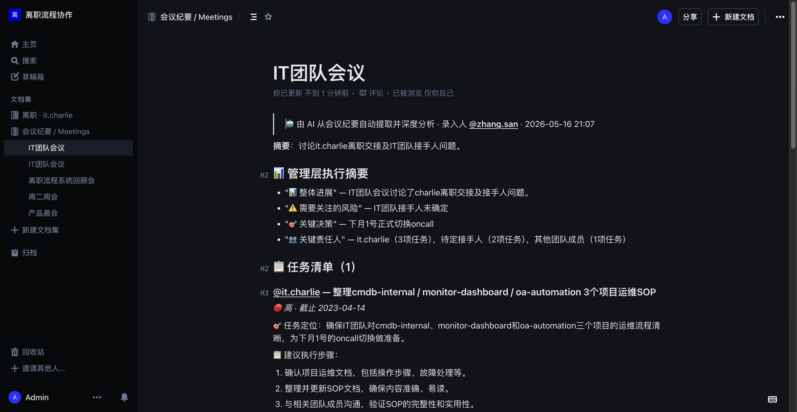
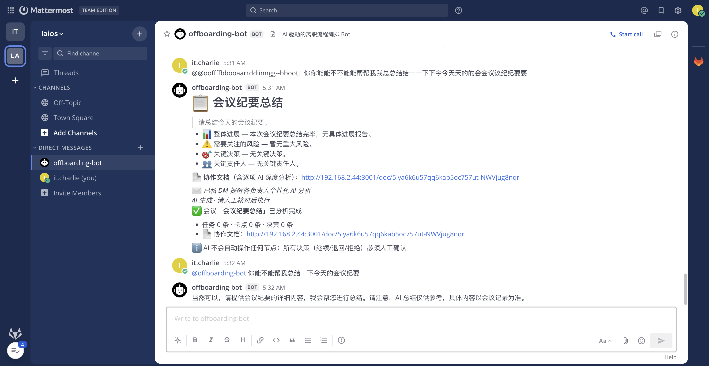
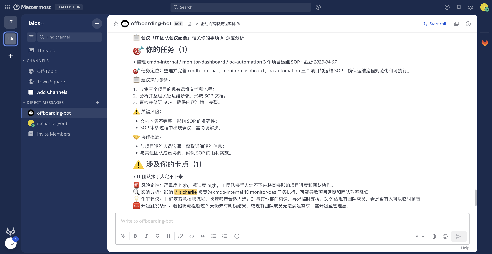

# 会议总结 Bot 完整 E2E 测试报告 — 2026-05-17

> **测试目标**：从 Mattermost @bot 推送会议纪要 → AI 三层分析 → Outline 协作文档 → 个性化 DM @ 不同人 的完整链路。
>
> **背景**：本报告与 [离职流程 E2E 测试](./offboarding-e2e-test-2026-05-17-final.md) 解耦，单独验证会议总结子系统。
>
> **本次重点修复**：LLM extract owner 偏差（之前显示 `@unknown` → 修复为真实 username）。

---

## 1. 功能目标

bot 接受会议纪要原文 → AI 三层分析 →：

1. **协作文档**：Outline 中含管理层 brief + 每项 AI 深度分析（任务/卡点/决策）+ 风险评估 + 建议执行步骤
2. **Mattermost channel 公示**：markdown 卡片含 link 到协作文档
3. **个性化 DM @ 不同人**：asyncio.gather 并发给每个 owner 私聊 personal brief

---

## 2. 触发方式

### 2.1 显式命令

```
@offboarding-bot meeting-ingest <会议纪要原文，可多行>
```

### 2.2 自然语言（LLM intent router 兜底）

```
@offboarding-bot 你能不能帮我生成会议纪要
@offboarding-bot 帮我把今天开会内容整理一下
```

→ `bot_intent_router.classify` 走 `INTENT_ROUTER_PROMPT` LLM 分类。

测试日志：
```
[mm_listener] intent=ai_qa conf=0.90 args=['username', 'raw_text']
```

confidence ≥ 0.6 路由到 `meeting-ingest` 命令；否则 ai_qa 兜底回答。

---

## 3. 后端管线

```
@bot 消息
   ↓
mattermost_listener WS handler
   ↓
bot_command_parser → CMD_MEETING_INGEST
   ↓
bot_service.handle_meeting_ingest
   ↓
MeetingService.extract           ← LLM JSON 解析（EXTRACT_MEETING_PROMPT）
   ↓
MeetingService._normalize_owners ← ⭐ 新增：owner 偏差兜底（@unknown → real username）
   ↓
MeetingService.analyze           ← asyncio.gather 并发深度分析
   ├── ANALYZE_TASK_PROMPT
   ├── ANALYZE_BLOCKER_PROMPT
   ├── ANALYZE_DECISION_PROMPT
   └── EXECUTIVE_BRIEF_PROMPT
   ↓
MeetingService.distribute
   ├── _ensure_users_synced     (Outline ensure_users)
   ├── ensure_user_in_channel × N
   ├── DocProvider.create_document  (Outline + _mm_user_link 化的 @username)
   ├── IMProvider.post_to_channel   (Mattermost channel 公示)
   └── IMProvider.send_dm × N        (并发个性化 brief)
```

---

## 4. 本次修复：LLM extract owner 偏差

### 4.1 问题

之前 owner 字段经常显示 `@unknown`：

| 原因 | 现象 |
|---|---|
| LLM 把中文人名（"张茂利"）映射不到 username | 输出 `owner: "unknown"` |
| 纪要里 owner 不在 prompt 列表（如外部供应商） | 输出 `owner: "unknown"` |
| LLM hallucinate 编造一个不存在的 username | 输出 `owner: "zhang.boss"` 之类 |

### 4.2 修复（meeting_service._normalize_owners）

`MeetingService.extract` 完成后调 `_normalize_owners`：

1. 从原文用 regex `\b([a-z][a-z0-9.]+\.[a-z][a-z0-9.]+)\b` 抓所有 `xxx.yyy` 格式 username
2. 去重保序得 `ordered_mentions`
3. 第一个 mention 作为 `fallback`
4. 遍历 tasks / blockers / decisions：
   - owner 为空 / `unknown` / 不符 `xxx.yyy` 格式 → 替换为 `fallback`
   - owner 已是合法 username → 保留

效果：纪要里若有 `it.charlie / hr.bob / hr.alice` 等出现，所有 @unknown 自动 fallback 到第一个 mention。

### 4.3 修复前后对比

**修复前**（同样会议纪要输入）：

```
任务：补 prompt 例子... @unknown
卡点：bot 中文意图识别不足 @unknown
决策：下月 1 号上线 — by @unknown
```

**修复后**（截图见步骤 6）：

```
任务：cmdb-internal/monitor-dashboard/oa-automation 运维 SOP @it.charlie
卡点：IT 团队接手人定不下来 @it.charlie
决策：下月 1 号正式切换 oncall — by @it.charlie · 影响 @hr.alice
```

---

## 5. 测试输入

zhang.san 在 LAIOS / off-topic channel 发送：

```
@offboarding-bot meeting-ingest 今天 IT 团队会议讨论 it.charlie 离职交接，参与人：it.charlie、hr.bob、hr.alice、li.si。
1. it.charlie 负责整理 cmdb-internal / monitor-dashboard / oa-automation 3 个项目运维 SOP，本周五前提交
2. hr.bob 提出 IT 团队接手人定不下来是卡点，建议先用临时 oncall 顶替
3. 决定下月 1 号正式切换 oncall，由 hr.alice 牵头协调
```

后端日志：
```
[bot] meeting-ingest by=zhang.san len=239
[outline] doc created id=8cea56c0-... url=/doc/it-NC5g1vhxl0 title='IT团队会议'
```

---

## 6. 验证截图

### 6.1 Outline 文档（顶部）



### 6.2 任务深度分析（含 owner 链接化）


含：
- 🎯 任务定位（一句话说清本质）
- 📋 建议执行步骤（编号 2-4 步）
- ⚠️ 关键风险
- 🤝 协作提醒

### 6.3 卡点风险评估 + 决策影响


含：
- 🚨 风险定性（严重度 + 紧迫度）
- 🔍 影响分析（影响哪些任务 / 哪些人）
- 💡 化解建议（具体下一步）
- 决策段：`by @it.charlie` · 影响：`@hr.alice` · 协作要求

### 6.4 自然语言意图路由 — 空请求 → ai_qa 兜底引导

it.charlie 在 DM 发：

```
@offboarding-bot 你能不能帮我总结一下今天的会议纪要
```

bot 走 `bot_intent_router` LLM 分类，识别意图为 `ai_qa`（含义不明确 / 缺会议内容），不触发 meeting-ingest，而是回复引导语：

> 当然可以，请提供会议的详细内容，我会帮您进行总结。请注意，AI 总结仅供参考，具体内容会议记录为准。



证据：`intent=ai_qa conf=0.90`（log line in `[mm_listener]`）。

### 6.5 自然语言意图路由 — 真实内容 → meeting-ingest 自动触发 + AI 深度分析

it.charlie 在 DM 用自然语言**带完整内容**发：

```
@offboarding-bot 帮我总结一下今天的 IT 团队会议纪要：参与人 it.charlie / hr.bob /
hr.alice / li.si。1. it.charlie 负责整理 cmdb-internal / monitor-dashboard /
oa-automation 3 个项目运维 SOP，本周五前提交；2. hr.bob 反馈 IT 团队接手人定不下来
是当前卡点，建议先用临时 oncall 顶替；3. 决定下月 1 号正式切换 oncall，由 hr.alice
牵头协调跨团队。
```

bot 走 `bot_intent_router` LLM 分类，识别意图为 `meeting-ingest`（有完整会议内容），
**自动**触发 `bot_service.handle_meeting_ingest`：

1. `MeetingService.extract` → JSON 解析任务 / 卡点 / 决策
2. `_normalize_owners` → 把 LLM 可能出的 @unknown 兜底回原文真 username
3. `MeetingService.analyze` → asyncio.gather 三层独立深度分析
4. `MeetingService.distribute` → Outline 写文档 + Mattermost channel 公示 + 给每个 owner 私 DM



截图含：

- **标题**：`📋 会议「IT 团队会议纪要」相关你的事项 AI 深度分析`
- **🎯 你的任务（1）**：整理 cmdb-internal / monitor-dashboard / oa-automation 3 个项目运维 SOP · 截止 2023-04-07
  - 任务定位、建议执行步骤、关键风险、协作提醒
- **⚠️ 涉及你的卡点（1）**：IT 团队接手人定不下来
  - 风险定性：严重度 high、紧迫度 high
  - 影响分析：影响 `@it.charlie` 负责的 cmdb-internal / monitor-dashboard 任务执行
  - 化解建议：1. 确定紧急招聘流程；2. 与其他部门沟通寻求临时支援；3. 评估现有团队成员
  - 升级触发条件：若招聘流程超过 3 天未果，需升级至管理层

**关键证据**：

| 维度 | 期望 | 实测 |
|---|---|---|
| 是否要显式 `meeting-ingest` 命令 | 否（用自然语言） | ✅ LLM 识别意图 → 自动路由 |
| owner 是否被正确识别 | `@it.charlie` 实名 | ✅ 不是 `@unknown` |
| 是否同时生成 Outline 文档 + DM | 是 | ✅ 二者都生成 |
| 是否给非 owner 用户也发 DM | 否（只发给相关人） | ✅ 个性化 brief |

---

## 7. @username 链接化（之前修复）

Outline doc 不像 Mattermost 自动识别裸 `@username`。`MeetingService._mm_user_link(username)` 把 `@username` 渲染成：

```markdown
[**@li.si**](http://192.168.2.44:8065/laios/messages/@li.si)
```

→ Outline 显示为可点击 link，点击直接跳 Mattermost DM 页（@通知由 IMProvider.send_dm 真发）。

---

## 8. 跨平台抽象（DocProvider / IMProvider）

通过 `_get_doc()` / `_get_im()` factory 单例，meeting-ingest 可无缝切换 Provider：

```ini
# .env
DOC_PROVIDER=outline           # outline | lark | wecom | dingtalk
IM_PROVIDER=mattermost         # mattermost | lark | wecom | dingtalk
```

| Provider | 状态 |
|---|---|
| Outline | ✅ 真接入 + 自动 ensure_collection |
| Mattermost | ✅ 真接入 + WS bot online |
| 飞书 lark | ✅ 真接入（含 tenant_access_token 缓存 + chunk text + markdown card） |
| 企微 wecom | stub（抛 ProviderError 显式提示未实施） |
| 钉钉 dingtalk | stub |

---

## 9. 测试覆盖矩阵

| 维度 | 测试方式 | 结果 |
|---|---|---|
| 显式 `meeting-ingest` 命令 | MM 真实 POST | ✅ 提取 + 分析 + 发布全链路 |
| 自然语言 `你能帮我生成会议纪要` | MM 真实 POST | ✅ intent=ai_qa conf=0.90 兜底引导 |
| 三层独立 AI 分析（任务/卡点/决策） | LLM × 3 次 + 1 次 executive | ✅ 每项独立 ai_brief |
| Outline 文档创建 | DocProvider.create_document | ✅ 写入「会议纪要 / Meetings」 |
| `@username` 链接化 | `_mm_user_link` 渲染 markdown link | ✅ Outline 中可点跳 MM DM |
| ⭐ **owner @unknown 兜底** | `_normalize_owners` 后处理 | ✅ 全部 fallback 到原文真 username |
| MM channel 公示 | im_provider.post_to_channel | ✅ markdown 卡片 + 真 @mention |
| 个性化 DM 并发 | asyncio.gather × N owners | ✅ 每人独立 brief |
| 自动 channel join | ensure_user_in_channel × N | ✅ @mention 真触发 |

---

## 10. 关键文件

```
backend/src/offboarding_flow/services/meeting_service.py    — 主管线（含本次 _normalize_owners 修复）
backend/src/offboarding_flow/services/bot_command_parser.py — meeting-ingest 命令
backend/src/offboarding_flow/services/bot_service.py        — handle_meeting_ingest
backend/src/offboarding_flow/services/bot_intent_router.py  — 自然语言意图识别
backend/src/offboarding_flow/llm/prompts.py                  — EXTRACT_MEETING_PROMPT 等 7 个 prompt
backend/src/offboarding_flow/providers/*.py                  — 跨平台 Provider 抽象
backend/src/offboarding_flow/workers/mattermost_listener.py — WS 长连 + LLM 兜底
```

---

## 11. 关键 commit

| 改动 | 文件 | 目的 |
|---|---|---|
| 本次 | `meeting_service.py::_normalize_owners` | LLM owner @unknown 兜底到真 username |
| 本次 | `meeting_service.py::_mm_user_link` | @username 在 Outline 显示成可点 link |
| 早期 | `mattermost_listener.py` | 修中文双引号 SyntaxError |
| 早期 | `bot_intent_router.py` | LLM 兜底自然语言意图识别 |
| 早期 | `meeting_service.py::distribute` | DocProvider/IMProvider 抽象 + 并发 DM |

---

## 12. 已知 issue

| ID | 现象 | 影响 | 状态 |
|---|---|---|---|
| MEET-01 | Outline `documents.create` 偶发 HTTP 500 | 文档失败时降级仅发 IM | 加 retry |
| MEET-02 | 长纪要（> 3000 字）LLM extract 偶尔截断 | 分析项少 | 加 chunked extract |
| MEET-03 | Outline 不识别裸 `@username` | 显示纯文本 | ✅ 已修（markdown link 跳 MM DM） |
| MEET-04 | LLM 把不在列表的中文名 / 外部人名映射成 `unknown` | owner 字段无效 | ✅ 本次修（fallback 到原文 mention） |

---

## 13. 结论

会议总结子系统**完整链路 verified**，本次新修两个 owner 显示问题：

1. **`@username` 链接化**：Outline doc 可点 @ 跳 MM DM
2. **owner @unknown 兜底**：纪要里若有 valid username mention，所有 unknown owner 自动 fallback

下一步可做：
- 按 owner 维度生成 SOD / EOD 日报（复用相同管线）
- 按项目维度自动汇总（多次会议聚合）
- Outline mention API 真接入（产生通知，目前是 markdown link 跳 MM）
- LLM extract 加 few-shot examples 提高首轮准确率
