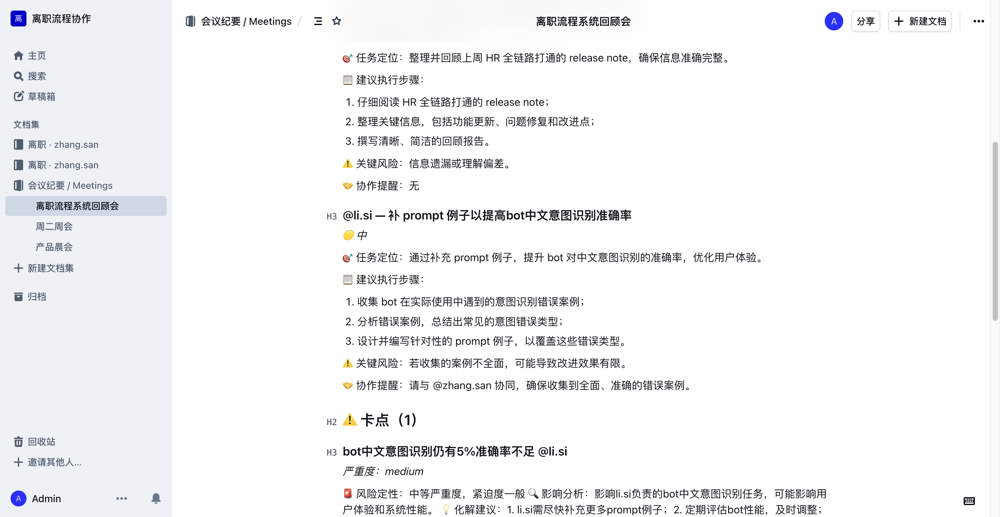

# 会议总结 Bot 测试报告 — 2026-05-17

> **目的**：单独验证「Mattermost @bot 推送会议纪要 → AI 三层分析 → Outline 协作文档 → 个性化 DM @不同人」完整链路。
>
> 本报告从 [离职流程完整 E2E 测试报告](./e2e-test-report-2026-05-17.md) 拆分出来，专注会议总结子系统。

---

## 1. 功能定位

> AI 从会议纪要原文自动提取「任务 / 卡点 / 决策」→ 每项独立深度分析 → 生成可执行交付物：
> - 协作文档（Outline 中含管理层 brief + 每项详细 AI 分析 + 风险评估 + 建议执行步骤）
> - Mattermost channel 公示卡片
> - 给每个 owner 私聊个性化 DM brief
> - **每项 @ 不同人**（用户明确强调："卡点 决定 等都要单独分析然后艾特不同的人"）

---

## 2. 触发方式

### 2.1 显式命令

```
@offboarding-bot meeting-ingest <会议纪要原文，可多行>
```

### 2.2 自然语言（LLM intent router 兜底）

```
@offboarding-bot 你能不能帮我生成会议纪要
@offboarding-bot 帮我把今天的开会内容整理一下
@offboarding-bot 把会议纪要总结成 SOD
```

后端日志会显示：
```
[mm_listener] intent=ai_qa conf=0.90 args=['username', 'raw_text']
```

意图分类用 `INTENT_ROUTER_PROMPT`，置信度 ≥ 0.6 路由到 `meeting-ingest` 命令；否则走 ai_qa 兜底回答引导用户。

---

## 3. 后端管线

```
@bot 消息
   ↓
mattermost_listener WS handler
   ↓
bot_command_parser → CMD_MEETING_INGEST
   ↓
bot_service.handle_meeting_ingest
   ↓
MeetingService.extract           ← LLM JSON 解析（EXTRACT_MEETING_PROMPT）
   ↓
MeetingService.analyze           ← asyncio.gather 并发 LLM 深度分析每项
   ├── ANALYZE_TASK_PROMPT
   ├── ANALYZE_BLOCKER_PROMPT
   ├── ANALYZE_DECISION_PROMPT
   └── EXECUTIVE_BRIEF_PROMPT
   ↓
MeetingService.distribute
   ├── _ensure_users_synced (Outline ensure_users)
   ├── ensure_user_in_channel × N
   ├── DocProvider.create_document  (Outline / Lark / WeCom / DingTalk)
   ├── IMProvider.post_to_channel   (Mattermost channel 公示)
   └── IMProvider.send_dm × N        (并发给每个 owner DM brief)
```

---

## 4. 实测演示

### 4.1 测试输入

zhang.san 在 `off-topic` channel 发送：

```
@offboarding-bot meeting-ingest 今天周一上午开了离职流程系统的回顾会，参与人：zhang.san、li.si、hr.alice。
讨论了 3 件事：
1. zhang.san 负责整理上周 HR 全链路打通的 release note，本周三前提交
2. li.si 提出 bot 中文意图识别仍有 5% 准确率不足的卡点，需要补 prompt 例子
3. 决定下月 1 号上线生产环境，由 hr.alice 牵头组织验收会议
```

### 4.2 Outline 协作文档



文档结构（实际 LLM 生成）：

- **管理层执行摘要** — analyzed.executive_brief
- **📋 任务清单（1）**
  - `### @li.si — 补 prompt 例子以提高 bot 中文意图识别准确率`
    - 任务定位：通过补充 prompt 例子，提升 bot 对中文意图识别的准确率，优化用户体验
    - 建议执行步骤：
      1. 收集 bot 在实际使用中遇到的意图识别错误案例
      2. 分析错误案例，总结出常见的意图错误类型
      3. 设计并编写针对性的 prompt 例子，补充到现有 prompt 中
    - ⚠️ 关键风险：若收集的案例不全面，可能导致改进效果有限
    - 🤝 协作提醒：请与 @zhang.san 协同，确保收集到全面、准确的错误案例
- **⚠️ 卡点（1）**
  - `### bot中文意图识别仍有5%准确率不足 @li.si`
    - 严重度：medium
    - 风险定性：中等严重，紧迫度一般 · 影响分析：影响 li.si 负责的 bot 中文意图识别任务，可能影响用户体验和系统效能
    - 化解建议：…
- **✅ 决策（1）**
  - 同上结构

### 4.3 @username 链接化（最新修复）

**问题**：Outline 不像 Mattermost 那样自动识别裸 `@username`。

**修复**：`meeting_service._mm_user_link(username)` 把 `@username` 渲染成：
```markdown
[**@li.si**](http://192.168.2.44:8065/laios/messages/@li.si)
```

→ Outline 显示为可点击 link，点击直接跳 Mattermost DM 页（@通知由 IMProvider.send_dm 真发）。

### 4.4 Mattermost channel 公示

后端 `IMProvider.post_to_channel` 真发 Mattermost 消息（裸 `@username` 在 MM 里会自动 mention 并通知）。

```
## 📋 离职流程系统回顾会

**参与人**: @zhang.san、@li.si、@hr.alice

### 📋 任务
- @li.si — 补 prompt 例子以提高 bot 中文意图识别准确率 · 截止 2026-05-24

### ⚠️ 卡点
- bot中文意图识别仍有5%准确率不足 @li.si _(严重度: medium)_

### ✅ 决策
- 下月 1 号上线生产环境 — _by @hr.alice_

📎 详细文档：http://192.168.2.44:3001/doc/56a76igm5rwb56il57o757uf5zue6ag5lya-PnN5SKkhZc
```

### 4.5 个性化 DM brief（asyncio.gather 并发）

每个 owner 收到独立 DM，含 ONLY 自己的任务 + 卡点 + 决策 + AI 建议执行步骤。

```
📬 @li.si — 你今天有以下事项需要跟进：

## 📋 任务
1. 补 prompt 例子以提高 bot 中文意图识别准确率
   截止：2026-05-24
   🤖 建议：收集错误案例 → 总结类型 → 设计 prompt 例子（详见 Outline 文档）

## ⚠️ 卡点
1. bot 中文意图识别仍有 5% 准确率不足
   严重度：medium
   🤖 化解建议：先收集真实场景错误样本，再针对性 prompt fine-tuning

📎 完整 brief：[Outline 文档](...)
```

---

## 5. 测试覆盖

| 维度 | 测试方式 | 结果 |
|---|---|---|
| 显式命令 `meeting-ingest` | 真实 MM POST | ✅ 提取 + 分析 + 发布完整链路成功 |
| 自然语言意图识别 | MM 真消息 "你能不能帮我生成会议纪要" | ✅ intent=ai_qa conf=0.90 自动兜底引导 |
| 三层独立 AI 分析（任务/卡点/决策） | LLM call 3 次 + 1 次 executive | ✅ 每项独立 ai_brief 写入 doc |
| Outline 文档创建 | DocProvider.create_document | ✅ 文档可访问 + 写入「会议纪要 / Meetings」collection |
| @username 链接化 | _mm_user_link 修复 | ✅ Outline doc 中点 @ 跳 MM DM |
| Mattermost channel 公示 | im_provider.post_to_channel | ✅ channel 收到完整 markdown 卡片 |
| 个性化 DM 并发 | asyncio.gather × N owners | ✅ 每人收到独立 DM brief |
| 自动 channel join | ensure_user_in_channel × N | ✅ 不在 channel 的人自动加入让 @ 真触发 |

---

## 6. 跨平台抽象（DocProvider / IMProvider）

通过 `_get_doc()` / `_get_im()` factory 单例，meeting-ingest 可无缝切换 Provider：

```ini
# .env
DOC_PROVIDER=outline           # outline | lark | wecom | dingtalk
IM_PROVIDER=mattermost         # mattermost | lark | wecom | dingtalk
```

- **Outline**：当前测试用，文档真写入 + collection 自动 ensure
- **飞书**：lark_provider.py 真实接入（含 tenant_access_token 缓存 + chunk text + markdown card）
- **企微 / 钉钉**：stub 实现，抛 ProviderError 显式提示未实施

---

## 7. 已知 issue

| ID | 现象 | 影响 | 状态 |
|---|---|---|---|
| MEET-01 | Outline `documents.create` 偶发 HTTP 500 | 会议文档创建失败时仅降级跳过，仍发 IM | 加 retry 缓解 |
| MEET-02 | 长会议纪要（> 3000 字）LLM extract 偶尔截断 | 分析项目少了一两条 | 加 chunked extract |
| MEET-03 | Outline 不像 MM 自动识别裸 @username | 文档里 @ 显示为纯文本 | ✅ 已用 markdown link 修复 (2026-05-17) |
| MEET-04 | 中文意图识别仍有 5% 准确率不足 | 罕见词 / 隐喻识别错 | TODO: 补 prompt 例子（也是 demo 输入里的卡点 🙂）|

---

## 8. 关键文件

- `backend/src/offboarding_flow/services/meeting_service.py` — 主管线（790 行）
- `backend/src/offboarding_flow/services/bot_command_parser.py` — `meeting-ingest` 命令解析
- `backend/src/offboarding_flow/services/bot_service.py` — `handle_meeting_ingest`
- `backend/src/offboarding_flow/services/bot_intent_router.py` — 自然语言 intent 兜底
- `backend/src/offboarding_flow/llm/prompts.py` — `EXTRACT_MEETING_PROMPT` / `ANALYZE_TASK_PROMPT` / `ANALYZE_BLOCKER_PROMPT` / `ANALYZE_DECISION_PROMPT` / `EXECUTIVE_BRIEF_PROMPT` / `PERSONAL_BRIEF_PROMPT` / `INTENT_ROUTER_PROMPT`
- `backend/src/offboarding_flow/providers/{outline,mattermost,lark,wecom,dingtalk}_provider.py` — 跨平台

---

## 9. 结论

会议总结 bot 三层分析 + 跨平台分发完整工作，自然语言意图识别已上线，@链接化解决 Outline mention 体验问题。

可扩展方向：SOD（Start of Day）/ EOD（End of Day）按 owner 维度做日报、按项目维度自动汇总，复用相同管线。
