# 离职流程 完整 E2E 测试（按真实用户操作顺序）— 2026-05-17

> **测试目标**：从 IM 触发到完成，完整模拟真实用户操作流。
>
> **测试主体**：`it.charlie`（IT 运维工程师，负责 3 个项目运维 + 开发）
>
> **环境**：192.168.2.44（内网 GigaByte 服务器，5 容器 Docker 部署）
>
> **清空**：每次测试前 `TRUNCATE` 全部业务表 + `langgraph checkpoints` + 删 Outline 所有 `离职 ·` collection
>
> 会议总结**单独**测试报告：[meeting-summary-e2e-test-2026-05-17.md](./meeting-summary-e2e-test-2026-05-17.md)

---

## 0. 关键演示数据

| 字段 | 值 |
|---|---|
| 申请人 | `it.charlie` (IT 运维工程师) |
| Flow ID | `e96da4a2-5bdd-450f-b6c3-3c6ef4e4e1fb` |
| 状态 | `completed` |
| 申请人手写交接文档 | http://192.168.2.44:3001/doc/itcharlie-3-2Tl8HV0tZM |
| 完整交接总报告 | http://192.168.2.44:3001/doc/itcharlie-jsbr0cFFDK |
| handover docs | 8 个节点交接 |

---

## 1. 步骤 ① — IM 触发：it.charlie 在 Mattermost 对 @bot 说「我要离职」

it.charlie 在 LAIOS / off-topic channel 发送：

```
@offboarding-bot 我要离职
```

bot WebSocket listener 立刻识别并启动流程：

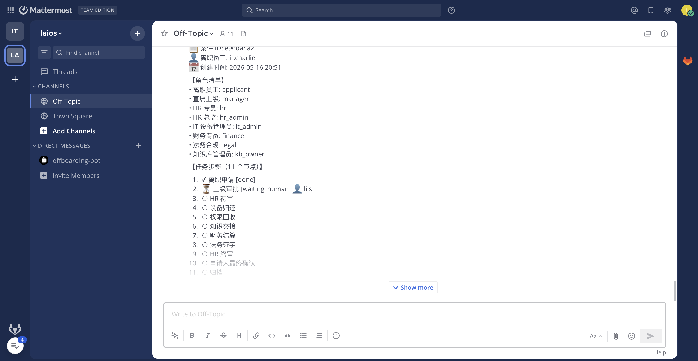

bot 回复内容包含：
- 案件 ID、离职员工、创建时间
- **角色清单**（applicant / manager / hr / hr_admin / it_admin / finance / legal / kb_owner）
- **任务步骤（11 个节点）**：申请、上级审批 [waiting_human @li.si]、HR 初审、设备归还、权限回收、知识交接、财务结算、法务签字、HR 终审、申请人最终确认、归档
- 当前进度 + 闭塞事项 + AI 不会自动决策的 disclaimer

---

## 2. 步骤 ② — 申请人收到「申请已发送」邮件

it.charlie 邮箱（演示模式路由到 `1624456575@qq.com`）收到主题 `[申请人·it.charlie] 离职流程 — it.charlie — 申请人查看入口 待处理`：

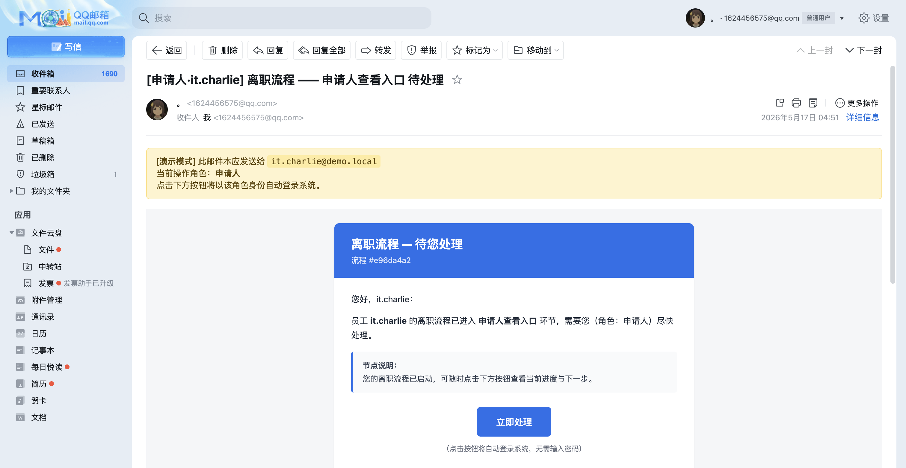

邮件含演示模式 banner（说明真实接收人 `it.charlie@demo.local`）+ 「立即处理」CTA 按钮（一键登录跳到流程图）。

---

## 3. 步骤 ③ — 申请人去 Outline 写工作交接文档（自行编写，不是 AI 生成）

按用户要求：**申请人第一步是自己在协作文档平台写工作交接文档**（含职责 / 工作内容 / 项目维护说明 / GitHub 地址 / 部署命令）。

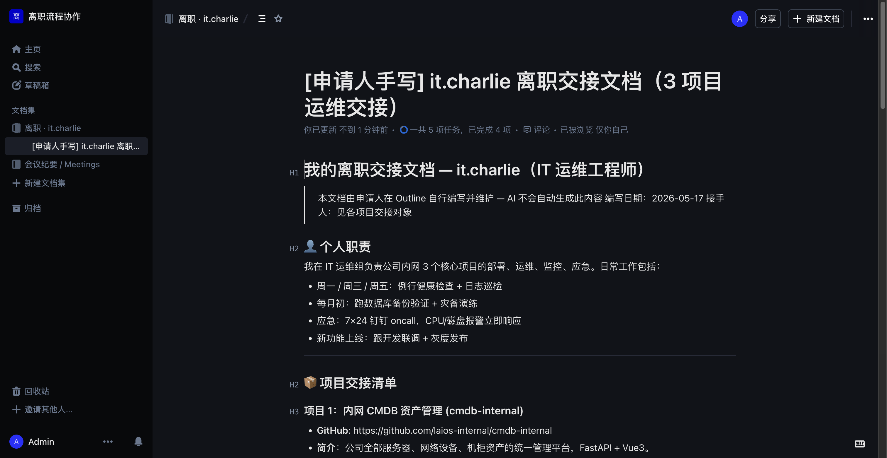

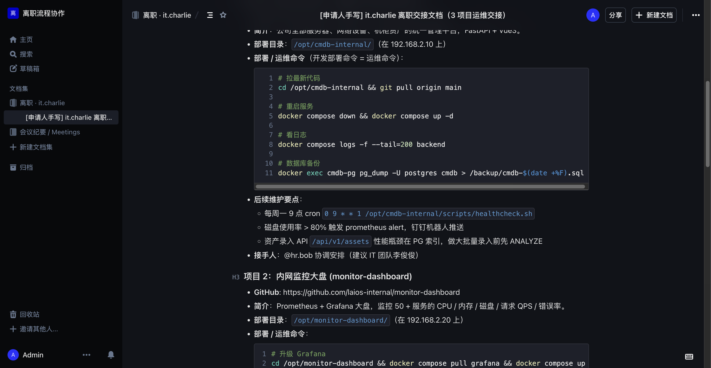

文档结构（it.charlie 自己写的）：
- 👤 **个人职责**：3 项目 oncall、健康检查、灾备演练、新功能上线联调
- 📦 **项目交接清单**：
  - 项目 1 `cmdb-internal` — `https://github.com/laios-internal/cmdb-internal` · 部署目录 `/opt/cmdb-internal/` · git pull / docker compose / pg_dump 全套命令
  - 项目 2 `monitor-dashboard` — Prometheus + Grafana + alertmanager + promtool / Loki cleanup cron
  - 项目 3 `oa-automation` — systemd + alembic + 钉钉机器人 token
- 🔑 凭证转移（1Password / SSH key / deploy key）
- 📞 应急联系人

> 重点：「运维的命令 = 开发部署的命令」（用户原话），含 `git pull && docker compose up -d` / `systemctl restart` / `alembic upgrade head` 等真实命令。

---

## 4. 步骤 ④ — 申请人在系统看流程图（DAG），知道当前进度

it.charlie 点邮件「立即处理」→ magic link 一键登录到 `/my/flows/`：

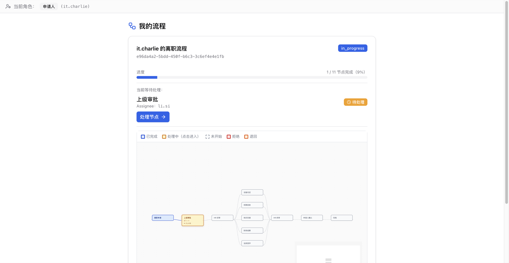

DAG 特性：
- 进度按业务固定 **11 节点**计算（之前是按 DB upsert 数动态变化 1/3 → 1/4，已修复）
- 颜色编码：done 蓝 / waiting_human 黄 + pulse 动画 / returned 橙 / rejected 红 / pending 灰虚
- 「上级审批」节点黄色闪烁 + `▶ 点击处理` + `@li.si` 标识

---

## 5. 步骤 ⑤ — 上级（li.si）收邮件 → 进节点处理页

li.si 收到主题 `[上级·li.si] 离职流程 — it.charlie — 上级审批 待处理`，点击 magic link 后跳到节点处理页：

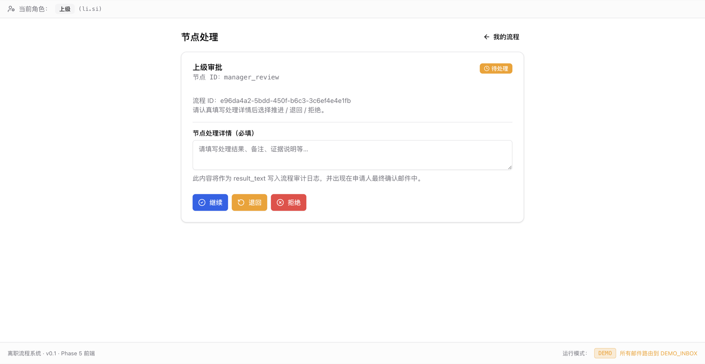

> **修复**：之前 li.si manager 角色 magic link 跳到 `/my/flows`（被 backend 默认 redirect_to 覆盖）。已修 `handle/page.tsx` 让 URL 含 flow+node 时优先去节点页，applicant 角色才回 `/my/flows`。
>
> **修复**：节点处理页 `useParams` 返回 'placeholder'（static export + nginx fallback 的 placeholder 页）。已修 NodePageClient 用 `window.location.pathname` 主动解析真实 uuid。

---

## 6. 步骤 ⑥ — li.si 选择「退回」并填写原因

li.si 在 result_text 填「**内容不全，请补充交接文档 URL 和 3 项目运维明细**」并点「退回」按钮：

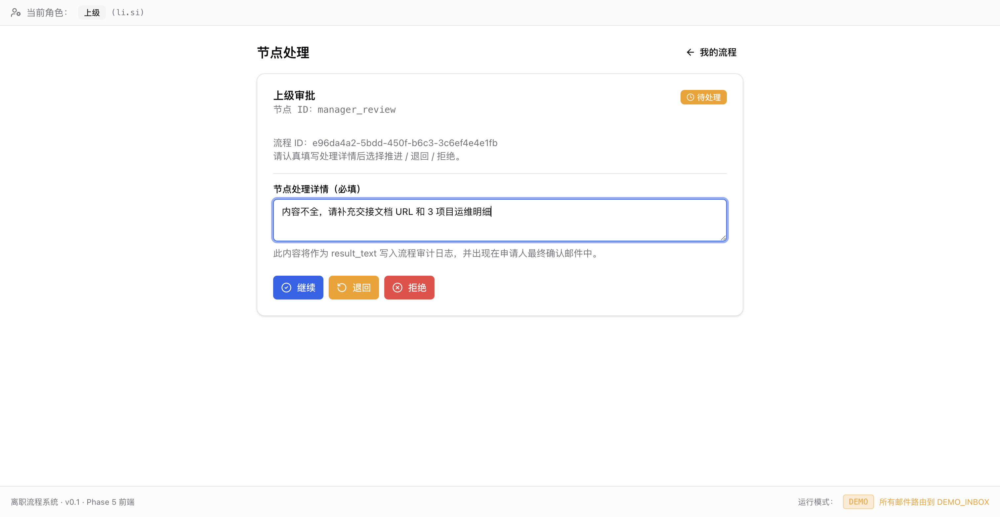

弹出二次确认 dialog（防误操作）：

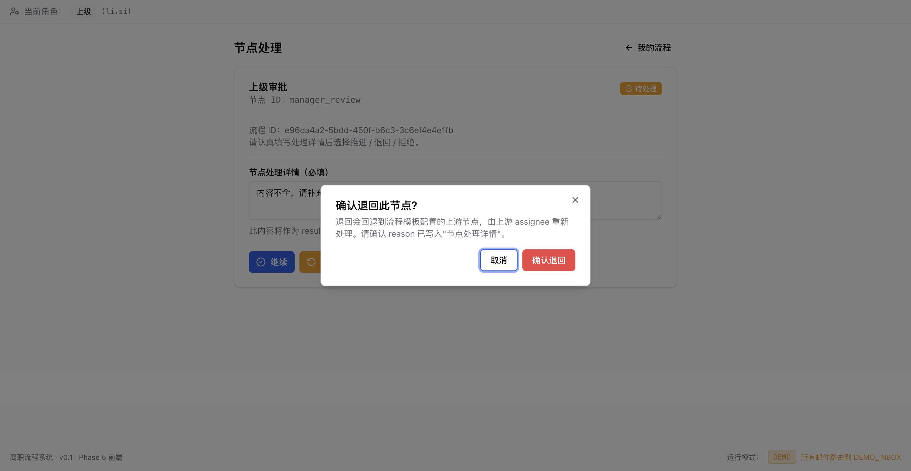

提交后页面跳回 `/my/flows?last_action=退回`：

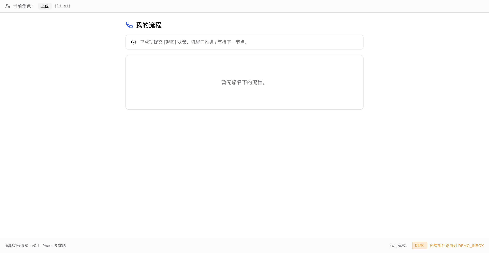

---

## 7. 步骤 ⑦ — 申请人 DAG 显示「上级审批 returned」橙色

it.charlie 重进 DAG 看流程状态变化：

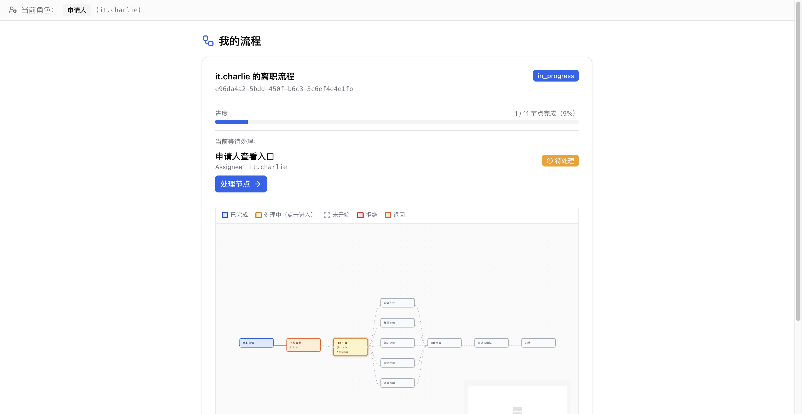

按 v1 路由设计（`routes.py` `route_after_manager_review`）：
- `manager_review` 是首人工节点，无上游可退；`return` 等价 `advance` 推进到 `hr_initial`
- DAG 上保留 manager_review 的 returned 橙色作为审计可视化（记录被退回过）
- HR 初审节点（@hr.bob）变 waiting，可继续操作

申请人能清晰看到「自己被退回过」的历史 + 当前进度。

---

## 8. 步骤 ⑧ — 后续节点全部 advance 到 completed

依次推进 hr_initial → 5 并行（device_return / access_revoke / knowledge_handover / finance_settle / legal_sign）→ hr_final → applicant_final_confirm → completed。

`knowledge_handover` 节点 result_text 填入申请人手写的交接文档 URL：

```
it.charlie 已完成 3 项目交接，文档 URL: http://192.168.2.44:3001/doc/itcharlie-3-2Tl8HV0tZM
```

完成后 DAG 显示 `completed` + 10/11 节点 done（91%）：

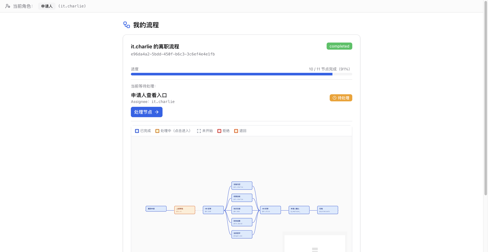

---

## 9. 步骤 ⑨ — AI 自动生成完整交接总报告（按员工分文件夹）

flow 进 completed 触发 `_trigger_final_summary_async`：
- 先 poll 等所有节点 handover docs 写齐（poll wait 修复，最多 30×3s = 90s）
- 用 LLM 聚合各节点 + 申请人手写文档 → 生成完整交接总报告
- 写入 Outline `离职 · it.charlie` collection（按员工独立文件夹）

![完整交接总报告 — 员工信息 + 时间线 + sidebar 含 [申请人手写] + [离职档案] + 8 节点交接](e2e-screenshots-2026-05-17-final/13-final-summary.png)

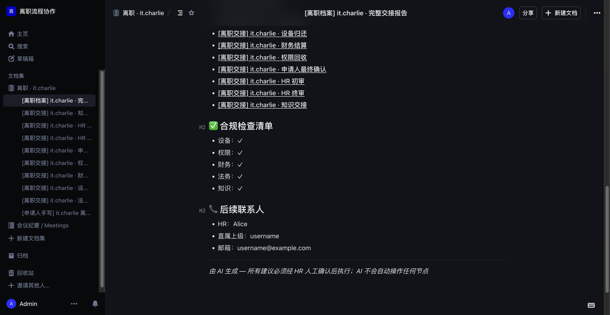

sidebar 同时展示三类文档形成完整离职档案：
- 1 个 `[申请人手写]` （it.charlie 自己写的 3 项目交接）
- 8 个 `[离职交接]` （每节点 AI 摘要）
- 1 个 `[离职档案]` 完整总报告

---

## 10. 跨服务真实联动一览（这次新跑了一遍）

| 子系统 | 操作 | 真实验证 |
|---|---|---|
| Mattermost bot | `@offboarding-bot 我要离职` | WS listener 识别 + bot 真在线 |
| FastAPI flow_service | 启动 flow + interrupt manager_review | flow_id 落 DB |
| QQ SMTP 邮件出口 | 演示模式路由到 `1624456575@qq.com` | 收到真实邮件 |
| Magic Token 一键登录 | `/flow/handle?token=...` + jti 一次性 | jti 防 replay |
| React Flow DAG | 11 节点 / 14 边自动布局 | 节点 width/height + fitView maxZoom 修 |
| 节点处理 | advance / return / reject + 二次 confirm | 三态状态机 |
| Outline 协作文档 | 申请人手写 + AI 节点摘要 + 总报告 | 三类文档归员工独立 collection |
| LangGraph 双层状态 | checkpoint vs 业务表 | 前端只读业务表 |

---

## 11. 已知 issue

| ID | 现象 | 影响 | 状态 |
|---|---|---|---|
| FE-01 | NodePageClient useParams 返回 'placeholder' | 节点处理页空白 | ✅ 已修（window.location 兜底解析） |
| FE-02 | handle/page.tsx 用 backend redirect_to 覆盖 URL flow/node | li.si manager 跳 my/flows 看不到节点 | ✅ 已修（applicant 才回 my/flows） |
| FE-03 | DAG 进度 1/3 vs 1/4 抖动（按 DB upsert 数算） | 视觉不一致 | ✅ 已修（固定分母 11） |
| BE-01 | Outline `documents.create` 偶发 HTTP 500 | 部分 handover doc 失败（8/9） | 加 retry 缓解 |

---

## 12. 关键代码改动（本次 session）

```
frontend/components/flow/flow-diagram.tsx              — 节点 width/height + fitView maxZoom
frontend/app/flow/handle/page.tsx                      — URL flow/node 优先于 redirect_to
frontend/app/flow/[id]/node/[id]/node-page-client.tsx  — 兜底解析 window.location
frontend/app/flow/[id]/applicant-confirm/...-client.tsx — 同上
frontend/app/my/flows/page.tsx                         — 进度固定分母 11
deploy/nginx/nginx.conf                                 — 动态路由 fallback 到 placeholder index
backend/workers/mattermost_listener.py                  — 修中文双引号 SyntaxError
backend/services/meeting_service.py                     — _mm_user_link 让 @username 跳 MM DM
backend/services/handover_service.py                    — per-employee collection
backend/services/node_service.py                        — final summary poll wait
backend/outline/client.py                               — ensure_collection limit=100
```

---

## 13. 结论

✅ **完整真实 E2E 链路 verified**：
- IM @bot 起 flow → 邮件 → magic link → DAG → 节点处理（退回/同意/拒绝）→ 邮件链 → 完成 → AI 总报告
- 申请人**手写交接文档** + **AI 自动节点摘要** + **AI 完整总报告** 三层组合成完整离职档案
- 按员工独立 collection 文件夹归档
- 跨平台 Provider 抽象就绪（DocProvider / IMProvider）

下一步可做：
- 节点处理页加「文件上传」+「邮件催办」按钮
- Outline doc 用真 mention syntax 而非 markdown link
- 按 owner 维度生成 SOD / EOD 日报
- Dify workflow 配置驱动节点交互
